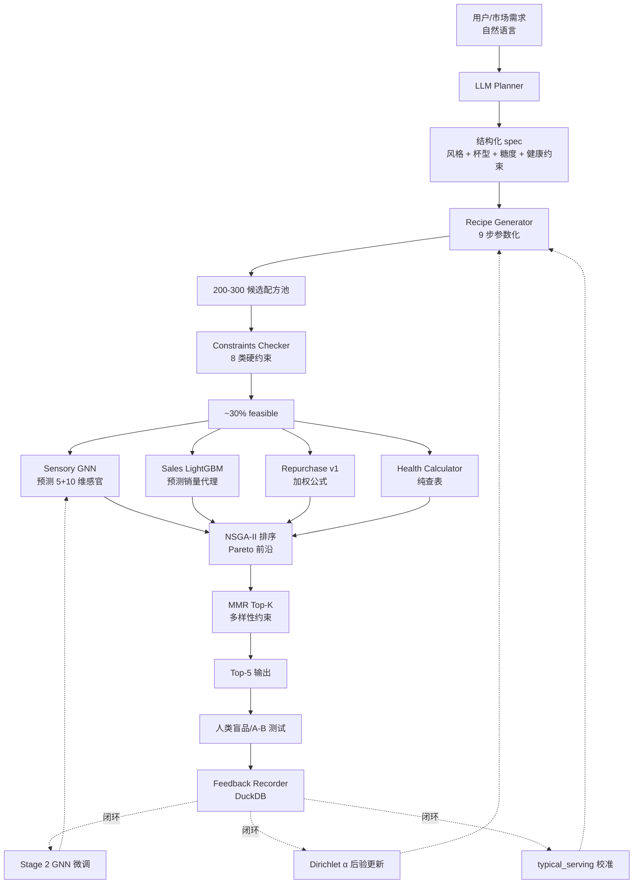

# beverage_ai — 项目技术文档

> **版本**:1.0
> **代码版本**:v0.1.0
> **日期**:2026-05-25
> **目标读者**:开发者 / 新成员 / 架构评审 / 6 个月后的自己

---

## 0. 文档说明

本文档是 **beverage_ai 项目的权威技术参考**。它的定位:

| 文档 | 角色 |
|---|---|
| 本文档(`技术文档.md`) | **WHAT exists**:系统当前的真实架构、模块、数据流、API |
| [`茶饮研发闭环AI系统_技术方案书.md`](茶饮研发闭环AI系统_技术方案书.md) | **WHY**:学术级方法论、风险、评估设计(技术规格) |
| [`茶饮研发闭环AI系统_v1实现方案.md`](茶饮研发闭环AI系统_v1实现方案.md) | **HOW to build**:8 周排期、每周 deliverable(执行规划) |
| [`../README.md`](../README.md) | 快速上手 |
| [`SCRAPING_NOTICE.md`](SCRAPING_NOTICE.md) | 爬虫法律合规 |
| [`AUTODL_SETUP.md`](AUTODL_SETUP.md) | 远程 GPU 训练操作 |
| [`PATH_A_RECIPE.md`](PATH_A_RECIPE.md) | 路径 A 数据采集流程 |
| [`../data/products/README.md`](../data/products/README.md) | SKU 销量数据集说明 |

读完本文档,你应该能:
- 理解系统每个模块的职责、输入、输出、依赖
- 找到任何功能对应的代码位置
- 知道数据怎么在系统里流动
- 知道如何运行、测试、扩展

---

## 1. 系统概述

### 1.1 项目定位

**beverage_ai** 是一个**新茶饮配方研发的闭环 AI 系统**。给定自然语言需求(例:"夏季年轻女性低糖轻负担,定价 18-22 元"),系统在 < 1 秒内输出 5 个差异化的候选配方,每个配方都:
- **物理可行**(总质量 = 杯容 ± 10%,糖溶解度合规)
- **法规合规**(咖啡因 ≤ GB 200mg,反式脂肪可控)
- **多目标权衡过**(喜爱度 / 销量代理 / 成本 / 含糖 4 维 Pareto 前沿)
- **风味多样化**(MMR 强制原料组合差异)

### 1.2 关键创新

1. **9 步层级化参数生成**:把 200+ 维稀疏向量降到 15 维语义参数(`recipes/generator.py`)
2. **上下文条件 Dirichlet 先验**:α 随季节/人群/健康约束动态调整(`priors/engine.py`)
3. **Bayesian 共轭后验更新**:每轮盲品后 α 自动校准(`priors/dirichlet.py`)
4. **不确定性感知优化**:LCB/UCB 代替均值,惩罚 OOD 区域的"模型幻觉"(`optimizer/acquisition.py`)
5. **双层输出头 GAT**:核心 5 维(双通路共训)+ 扩展 10 维(仅 Stage 1)(`simulators/sensory/`)
6. **品牌固定效应 + K 折交叉拟合**:销量预测剥离"贵的卖得好"的 confounder(`simulators/sales/`)

### 1.3 v1 当前能力 / 不能力

| 能力 | 状态 | 备注 |
|---|---|---|
| 端到端推理 pipeline | ✅ | < 1 秒,纯 CPU |
| Gradio web demo | ✅ | `python demo/app.py` |
| CLI 工具 | ✅ | `beverage-ai pipeline/health/generate/...` |
| 感官 GNN 真实训练 | ✅ | CUDA, 753 train, Stage 1 + Stage 2 |
| 销量 LightGBM 真实训练 | ✅ | 品牌 FE + 季节 + 城市层级 |
| Bayesian 后验更新 | ✅ | 3 个 snapshot 已落盘 |
| 词表(207+ 条) | ✅ | 219 条,11 类全覆盖 |
| 215 单元/集成测试 | ✅ | 全部通过 |
| 真实人类盲品 | ❌ | 用合成数据替代,严谨性缺口 |
| 大众点评/小红书爬虫 | ❌ | 故意不做,见 `SCRAPING_NOTICE.md` |
| Wilcoxon/Friedman 统计分析脚本 | ❌ | Week 8 deliverable 缺失 |
| CI(GitHub Actions) | ❌ | |

---

## 2. 系统架构

### 2.1 总体架构



### 2.2 数据流(从需求到落盘)

| 阶段 | 输入 | 处理 | 输出 |
|---|---|---|---|
| 1. 解析 | `"夏季低糖轻负担"` | `LLMPlanner.plan()` | spec dict(JSON Schema 校验) |
| 2. 生成 | spec + Dirichlet α | `RecipeGenerator.generate(n=300)` | `list[Recipe]` 200-300 个 |
| 3. 守恒重标 | 每个 Recipe | `reconcile()` 自动缩液体/补水 | Recipe(总量 = 杯容 ±10%) |
| 4. 健康计算 | Recipe + Vocab | `compute_nutrition()` 查表 | dict(kcal/sugar/fat/caffeine/...) |
| 5. 约束检查 | Recipe + nutrition + targets | `check_constraints()` | `list[ConstraintViolation]` |
| 6. 仿真器并行 | Recipe(若 feasible) | 4 个 Predictor.predict() | sensory/sales/health/repurchase predictions |
| 7. NSGA-II | 87 feasible × 4 obj | `non_dominated_sort()` | Pareto 前沿(本例 24 个) |
| 8. MMR | Pareto + GNN embedding | `mmr_select(k=5, λ=0.6)` | 5 个 index |
| 9. 持久化 | Top-5 + spec + predictions | `FeedbackRecorder.record_recipe()` | DuckDB 写入 |

### 2.3 模块依赖图

```
ingredients/  ←──── (基础,无内部依赖)
       ↑
       ├── recipes/(schema, reconciler, generator)
       │        ↑
       │        └── priors/(engine, dirichlet) ←── (互相 TYPE_CHECKING 引用)
       │
       ├── constraints/ ←── recipes
       │
       ├── simulators/
       │      ├── health/    ←── recipes + ingredients
       │      ├── sensory/   ←── recipes + ingredients + torch[ml]
       │      ├── sales/     ←── recipes + lightgbm[ml]
       │      └── repurchase/←── simulators/sensory
       │
       ├── optimizer/  ←── recipes + constraints + simulators
       │
       ├── planner/    ←── (anthropic[llm], 可 mock)
       │
       ├── aspects/    ←── scrapers + ingredients + (anthropic[llm], 可 mock)
       │
       ├── scrapers/   ←── (playwright[scrape], 可 mock + local_file)
       │
       ├── feedback/   ←── recipes + duckdb
       │
       └── pipeline/end_to_end.py  ←── 上面所有(总编排)
                ↑
                cli.py(typer)
                demo/app.py(gradio[demo])
```

**关键工程决策**:
- `recipes/__init__.py` 与 `priors/__init__.py` 有循环类型引用,用 `TYPE_CHECKING + "PriorEngine"` 字符串 annotation 解决
- ML 重依赖(`torch`/`lightgbm`/`gradio`/`anthropic`)全部 lazy import,无依赖时回退 Mock,核心 pipeline 仍可跑

---

## 3. 模块详细说明

每个模块给:**职责 / 关键类与函数 / 输入输出 / 内部依赖 / 测试位置**。

### 3.1 `beverage_ai.ingredients` — 原料词表

**职责**:加载 219 条原料的营养/分类/风味描述,提供查询 API。

```
ingredients/
├── vocab.py         Vocab 类 + Ingredient pydantic 模型
└── aliases.py       AliasResolver 中文/品牌名 → vocab id
```

**关键类**:

```python
class Ingredient(BaseModel):
    id: str                          # 如 'tea_jinxuan'
    name_zh: str                     # '金萱乌龙'
    name_en: str                     # 'Jin Xuan Oolong'
    category: Category               # 11 种之一
    typical_serving_g: float
    allergens: list[str]             # ['milk', 'gluten', ...]
    cost_tier: 'low'|'medium'|'high'|'premium'
    supply: 'stable'|'seasonal'|'volatile'
    nutrition_per_100g: IngredientNutrition
    flavor_descriptors: list[str]    # ['floral', 'creamy', ...]
    source: str                      # 数据出处

class Vocab:
    def get(id_: str) -> Ingredient
    def by_category(cat: Category) -> list[Ingredient]
    def __contains__(id_: str) -> bool
    def ids() -> list[str]
    def search_by_descriptor(desc: str) -> list[Ingredient]
    @classmethod
    def from_yaml(path) -> Vocab

# 便捷接口
def load_default_vocab() -> Vocab  # 直接加载 data/ingredients/ingredient_vocab.yaml
```

**11 个 category**:`tea_base`, `dairy_base`, `alt_milk_base`, `coffee_base`, `sweetener`, `fruit`, `topping`, `flavoring`, `auxiliary`, `gel`, `grain`

**数据规模**:219 条(tea 40 / dairy 14 / alt_milk 9 / coffee 8 / sweetener 19 / fruit 45 / topping 31 / flavoring 27 / aux 10 / gel 8 / grain 8)

**测试**:
- `tests/unit/test_vocab.py`(10 测试):加载、schema 校验、查询接口
- `tests/unit/test_vocab_completeness.py`(39 测试):每类最少数量、关键 id 存在性、致敏原一致性、咖啡因合理性

### 3.2 `beverage_ai.recipes` — 配方数据契约 + 生成器

**职责**:统一 Recipe schema,实现 9 步生成器和守恒重标定。

```
recipes/
├── schema.py        Recipe pydantic 模型 + 风格/糖度 Literal 类型
├── generator.py     RecipeGenerator 9 步参数化
└── reconciler.py    总质量守恒后处理
```

**关键类型**:

```python
SugarLevel = Literal['无糖', '三分', '五分', '七分', '全糖']
Style      = Literal['纯茶', '奶茶', '果茶', '咖啡奶茶', '冰沙', '特调']
CupSize    = Literal[380, 500, 700]   # ml

class Recipe(BaseModel):
    recipe_id: str
    style: Style
    cup_volume_ml: CupSize
    ingredients: dict[str, float]   # {vocab_id: gram}
    process: Process
    sugar_level: SugarLevel
    metadata: dict

    def total_mass_g() -> float
    def has_category(vocab, category) -> bool

# 糖度档位 → 克数(按 cup 线性缩放)
sugar_level_to_grams('五分', 500) == 13.0
```

**生成器**(`RecipeGenerator`,见 [§5.1 推理 pipeline](#51-推理-pipeline-6-段)):

```python
class RecipeGenerator:
    def __init__(self, vocab, prior, seed=42)
    def generate(planner_output, n_candidates=200) -> list[Recipe]

    # 内部 9 步 _one_recipe():
    # 1. style       从 planner 或随机
    # 2. cup_volume  380/500/700
    # 3. Dirichlet α 采样 → 6 维体积比 × cup → 各角色克数
    # 4. tea         按 flavor_keywords 偏向(关键词命中 = 高分)
    # 5. milk        60% dairy / 40% alt_milk 概率分支
    # 6. sweetener   按等甜度系数换算实际克数
    # 7. toppings    按风格抽 0-3 个 + 相容矩阵
    # 8. flavorings  抽 0-2 个(可按 keyword 偏向)
    # 9. ice         Dirichlet 给的 ice 分量
    # 10. reconcile  Step 10 守恒重标定
```

**关键词偏向**(`_score_ingredient_for_keywords`):
- name_zh 子串匹配 +3
- notes_zh 子串匹配 +2
- 经 `keyword_aliases.yaml` 映射到英文描述符匹配 +1

**Reconciler**:
```python
def reconcile(recipe: Recipe) -> Recipe:
    # 总量 > 杯容 × 1.10 → 按比例缩液体(保留固体)
    # 总量 < 杯容 × 0.85 → 补 aux_pure_water
```

**测试**:
- `tests/unit/test_schema.py`(9):round-trip、不合法值拒绝、helpers
- `tests/unit/test_generator.py`(5):风格遵守、守恒、去重、health_strict 偏好
- `tests/unit/test_reconciler.py`(4):溢出/亏空/边界
- `tests/unit/test_keyword_bias.py`(14):中文关键词偏好正确性
- `tests/unit/test_reference_recipes.py`:110 条参考配方 schema 校验

### 3.3 `beverage_ai.constraints` — 约束检查器

**职责**:对 Recipe + nutrition 执行硬/软约束,返回违规列表。

```python
class ConstraintViolation(BaseModel):
    code: str           # 'VOLUME_OVERFLOW', 'CAFFEINE_GB', ...
    severity: 'hard'|'soft'
    message: str

def check_constraints(recipe, nutrition, targets, vocab) -> list[ConstraintViolation]

def is_feasible(violations) -> bool   # 无 hard violation → True
```

**8 类约束**(`constraints/checker.py`):

| Code | Severity | 检查 |
|---|---|---|
| `VOLUME_OVERFLOW` | hard | 总质量在 [0.85, 1.10] × cup_volume_ml |
| `CAFFEINE_GB` | hard | caffeine ≤ targets['caffeine_limit_mg'](默认 200, GB/T 21733)|
| `TRANS_FAT` | hard | targets['trans_fat_zero']=True 时反式脂肪必须 = 0 |
| `SUGAR_LIMIT` | hard | sugar ≤ targets['sugar_limit_g'] |
| `CALORIE_LIMIT` | hard | energy ≤ targets['calorie_limit_kcal'] |
| `SODA_DAIRY` | hard | 苏打水 + 乳基不可共存(凝固) |
| `ALLERGEN` | hard | 致敏原集合 ∩ targets['excluded_allergens'] = ∅ |
| `TOPPING_COUNT` | soft | 配料 ≤ targets['max_toppings'](默认 3)|

**测试**:`tests/unit/test_constraints.py`(8 测试,每类 ≥ 1 pos + 1 neg)

### 3.4 `beverage_ai.simulators` — 4 个仿真器

**总体结构**:
```
simulators/
├── health/calculator.py        compute_nutrition() 纯查表
├── sensory/
│   ├── model.py                SensoryGATProto torch nn.Module
│   ├── predict.py              SensoryPredictor Protocol + Mock + Real
│   └── (训练脚本在 scripts/)
├── sales/
│   ├── model.py                SalesPredictorLGB (LightGBM 包装)
│   └── predict.py              Protocol + Mock + Real
└── repurchase/v1_weighted.py   v1 加权公式
```

#### 3.4.1 Health Calculator (纯查表)

```python
def compute_nutrition(recipe: Recipe, vocab: Vocab) -> dict:
    # 输出:energy_kcal, sugar_g, fat_g, trans_fat_g, caffeine_mg,
    #       sodium_mg, allergens, has_trans_fat, missing_nutrition_for
```

- `COOKING_FACTOR` 字典处理吸水/缩水(珍珠 × 2.5, 奇亚籽 × 8)
- 缺失原料追加到 `missing_nutrition_for`,不抛错

#### 3.4.2 Sensory GNN (双层输出头 GAT)

**架构** (`SensoryGATProto`):
```
input: Recipe → graph
    nodes: 5 维营养 + 11 维 category one-hot = 16 维节点特征
    edges: 全连接(每对原料都有相互作用)
    ↓
GATv2Conv(16, 64, heads=4)        # 第 1 层 GAT
GATv2Conv(256, 64, heads=4)       # 第 2 层 GAT
global_mean_pool + global_max_pool # 读出 → 512 维
Linear(512, 128)                  # projection
    ↓ (分流)
head_mean   → 5 维(甜苦茶奶喜爱度)
head_logvar → 5 维(异方差不确定性)
```

**Stage 1 预训练**(`scripts/train_sensory_gnn_stage1.py`):
- 路径 A 弱标签(LLM 抽取的评论 aspect),~14998 cached
- 全模型训练,异方差 NLL loss
- 实际跑通:753 train, 188 val, 50 epochs, best at epoch 32, val_loss=-1.66

**Stage 2 微调**(`scripts/train_sensory_gnn_stage2.py`):
- 路径 C 真实/合成盲品评分
- **冻结 backbone**,仅微调 head_mean + head_logvar(1290 个参数)
- 实际跑通:21 配方,Stage 1 zero-shot 喜爱度 r=0.86 → Stage 2 r=0.88

**Predictor API**(`predict.py`):
```python
class SensoryPredictor(Protocol):
    version: str
    def predict(recipe: Recipe) -> SensoryPrediction
    def embed(recipe: Recipe) -> np.ndarray   # 16d for MMR

class MockSensoryPredictor:   # 基于关键词的实现,无 torch 依赖也能跑
class RealSensoryPredictor:   # 加载 .pt checkpoint,跑真模型
```

#### 3.4.3 Sales LightGBM (品牌固定效应 + K 折)

**两阶段训练**(`SalesPredictorLGB.fit`):

```python
# Step 1: K=5 折交叉拟合 baseline
for tr, va in KFold(5).split(baseline_df):
    m = LGBMRegressor(...).fit(baseline_df.iloc[tr], y[tr])
    residuals[va] = y[va] - m.predict(baseline_df.iloc[va])  # OOF 残差

# Step 2: 配方模型拟合 OOF 残差(quantile median)
recipe_model = LGBMRegressor(objective='quantile', alpha=0.5)
recipe_model.fit(recipe_embed_df, residuals)

# Step 3: 0.05/0.95 分位数模型,用于 σ 估计
q05 = LGBMRegressor(objective='quantile', alpha=0.05)
q95 = LGBMRegressor(objective='quantile', alpha=0.95)
```

**特征**(实际训练时使用):
- baseline:品牌 one-hot(10 品牌)+ 季节 + 城市层级
- recipe embed:配方 GNN 嵌入

**预测**:`{'mean': ..., 'sigma': (q95-q05)/3.29, 'baseline': ..., 'recipe_contribution': ...}`

#### 3.4.4 Repurchase v1 (加权公式)

```python
class RepurchasePredictorV1:
    def __init__(self, alpha=0.7, beta=0.2, gamma=0.1):
        # α + β + γ = 1

    def predict(sensory: SensoryPrediction) -> RepurchasePrediction:
        liking_norm = (sensory.means['喜爱度'] - 1) / 4   # 1-5 → 0-1
        score = α * liking_norm + β * review_intent + γ * social_decay
```

**诚实声明**:v1 本质是"喜爱度的别名"(只有 α 真实活跃),真实 POS 数据接入后升级到 DeepSurv(v2)。

**测试**(simulators 整体):
- `tests/unit/test_health.py`(6):行业典型值校验、反式脂肪检测、吸水系数
- 集成测试在 `tests/integration/test_pipeline.py`

### 3.5 `beverage_ai.optimizer` — 多目标优化

```
optimizer/
├── acquisition.py    LCB / UCB(不确定性感知)
├── mmr.py            Maximal Marginal Relevance(多样性选 Top-K)
├── nsga2.py          非支配排序 + ScoredCandidate dataclass
└── problem.py        score_candidates() 把 4 个仿真器结果转 4 维目标
```

**LCB/UCB**(`acquisition.py`):
```python
def lcb(mean, sigma, kappa=1.0):  # 最大化目标用 → 优化器最大化 (mean - κσ)
    return mean - kappa * sigma

def ucb(mean, sigma, kappa=1.0):  # 最小化目标用 → 优化器最小化 (mean + κσ)
    return mean + kappa * sigma
```

**4 个目标的组合**(`problem.score_candidates`):
```python
objectives = np.array([
    -lcb(pref_mean, pref_sigma, κ),     # max preference  → 取负
    -lcb(sales_mean, sales_sigma, κ),   # max sales       → 取负
    cost_cny,                            # min cost
    sugar_g,                             # min sugar
])
```

**Pareto 前沿提取**(`nsga2.non_dominated_sort`):
```python
def _dominates(a, b):
    return all(a <= b) and any(a < b)   # a 严格不劣于 b

def pareto_front(scored: list[ScoredCandidate]) -> list[ScoredCandidate]:
    # 只返回非支配解
```

**MMR Top-K**(`mmr.mmr_select`):
```python
def mmr_select(scores, embeddings, k, lam=0.6) -> list[int]:
    selected = [argmax(scores)]
    while len(selected) < k:
        for i in remaining:
            relevance = norm_scores[i]
            diversity = min(L2(emb[i], emb[j]) for j in selected)
            mmr[i] = lam * relevance + (1-lam) * diversity
        selected.append(argmax(mmr))
```

**测试**:
- `tests/unit/test_acquisition_mmr.py`(10):公式正确性、k=1/n 边界、λ 极值行为

### 3.6 `beverage_ai.planner` — LLM Planner

**职责**:自然语言需求 → 结构化 JSON spec。

```python
PLANNER_SCHEMA = {  # JSON Schema
    'required': ['style_hint', 'cup_volume_ml', 'sugar_level', 'health'],
    'properties': {
        'style_hint':    {'enum': ['纯茶','奶茶','果茶','咖啡奶茶','冰沙','特调']},
        'cup_volume_ml': {'enum': [380, 500, 700]},
        'sugar_level':   {'enum': ['无糖','三分','五分','七分','全糖']},
        'health':        {...},
        'context':       {'season', 'target_age', 'health_strict'},
        'flavor_keywords': [...],
        'price_range_cny': [low, high],
    },
}

class LLMPlanner:      # Claude Haiku 实现
class MockLLMPlanner:  # 关键词驱动的 fallback(无 API key 也能跑)

def get_default_planner() -> PlannerInterface:
    if os.environ.get('ANTHROPIC_API_KEY') and use_real_llm_flag:
        return LLMPlanner()
    return MockLLMPlanner()
```

**Mock 关键词识别**:夏/春/秋/冬、无糖/三分/...、年轻/上班族、健康/低卡/控糖、纯茶/奶茶/果茶、桂花/茉莉/葡萄/...

**测试**:`tests/unit/test_planner.py`(5),覆盖 Mock 的关键词解析。

### 3.7 `beverage_ai.priors` — 用量先验引擎

**职责**:维护 6 风格 × 6 角色的 Dirichlet α,支持上下文条件 + Bayesian 共轭后验更新。

```
priors/
├── engine.py         PriorEngine 主接口
└── dirichlet.py      数学:partition_of_recipe + bayesian_update_alpha
```

```python
ROLES = ('tea', 'milk', 'fruit', 'water', 'coffee', 'ice')

class PriorEngine:
    base_alpha:     dict[str, list[float]]    # {style: [α_tea, ..., α_ice]}
    context_deltas: dict[str, dict[str, dict[str, float]]]
    history_dir:    Path

    def get_dirichlet_alpha(style, context=None) -> np.ndarray:
        # α(style) + Σ delta(feature, value) → clip ≥ 0.05

    def update_dirichlet_posterior(
        style, observed_recipes, scores, learning_rate=0.3
    ) -> np.ndarray:
        # 1. 取 top 30% 评分
        # 2. partitions = [partition_of_recipe(r) for r in good]
        # 3. α_obs = N_good × mean(partitions)
        # 4. α_new = α + lr × α_obs
        # 5. clip + 持久化 snapshot
```

**配置数据**(`data/priors/`):
- `dirichlet_alpha_v1.yaml`:6 风格初始 α(见技术方案书 §E.5.1)
- `context_deltas.yaml`:season/target_age/health_strict 的 α 修正
- `prior_history/<style>_<timestamp>.json`:每次更新落 snapshot,可回滚

**测试**:`tests/unit/test_priors.py`(7),包括 KL 散度 bound 测试(10 次更新不发散)。

### 3.8 `beverage_ai.feedback` — DuckDB 反馈存储

```python
class FeedbackRecorder:
    def record_recipe(session_id, recipe, predicted, context)
    def record_actual(session_id, recipe_id, actual)
    def record_panel(session_id, recipe_id, panelist_id, dim, score, cup_order, block)
    def list_sessions() -> list[str]
    def get_recipes(session_id) -> list[(id, dict)]
    def get_panel_scores(session_id)
```

**两张表**(`feedback.duckdb`):

```sql
CREATE TABLE feedback (
    session_id  VARCHAR, recipe_id VARCHAR,
    recipe_json JSON, pred_json JSON, actual_json JSON, context_json JSON,
    ts          TIMESTAMP
);

CREATE TABLE panel_score (
    session_id  VARCHAR, recipe_id VARCHAR, panelist_id VARCHAR,
    dimension   VARCHAR,    -- '甜度' / '苦度' / ...
    score       SMALLINT,   -- Likert 1-5
    cup_order   SMALLINT,   -- Latin square 顺序
    block       SMALLINT,   -- BIBD 块号
    session_dt  TIMESTAMP
);
```

**当前数据量**(`s_demo_w1`):21 条 feedback + 1050 条 panel_score(合成)。

### 3.9 `beverage_ai.aspects` — LLM 感官抽取(bonus 子系统)

**职责**:把路径 A 的真实评论文本 → 结构化 (aspect_scores, customization)。

```
aspects/
├── schema.py         CORE_DIMS (5) + EXT_DIMS (10) + ExtractedAspects
├── extractor.py      Protocol + ClaudeAspectExtractor + MockAspectExtractor
├── customization.py  正则解析糖度/冰量/小料/杯型
├── cache.py          DuckDB 缓存 (review_id, version) → 结果
└── pipeline.py       批处理 + self-consistency + 成本天花板
```

**Self-consistency**(`AspectExtractionPipeline`):
- 同一评论调 3 次 LLM,每维度取中位数(对抗 LLM 输出不稳定)
- 版本号 tagged `|sc` 后缀,缓存隔离

**缓存命中率**:版本变了自动 invalidate(prompt 改版触发重抽取)。

**当前数据量**(`aspects_cache.duckdb`):14998 条已抽取。

**测试**:
- `tests/unit/test_aspect_extractor.py`(14)
- `tests/unit/test_aspect_cache.py`(6)
- `tests/unit/test_customization.py`(18)

### 3.10 `beverage_ai.scrapers` — 评论数据采集(bonus 子系统)

```
scrapers/
├── base.py           ReviewRecord + BaseScraper Protocol
├── store.py          RawReviewStore (Parquet + DuckDB query)
├── runner.py         ScrapeRunner 编排
└── adapters/
    ├── mock.py             ⭐ 8 品牌 × 多 SKU 合成评论(测试用)
    ├── local_file.py       ⭐ CSV/JSON/JSONL 本地文件
    ├── hf_dataset.py       ⭐ HuggingFace 公开中文数据集
    ├── weibo_api.py        ⭐ 微博公开 API
    ├── llm_synthetic.py    ⭐ LLM 合成评论生成
    ├── dianping.py         🟡 大众点评 SKELETON(法律风险,见 SCRAPING_NOTICE.md)
    └── xiaohongshu.py      🟡 小红书 SKELETON
```

**ReviewRecord schema**:
```python
class ReviewRecord(BaseModel):
    review_id:         str            # 确定性 hash(source|brand|text)
    source:            str
    brand:             str | None
    sku:               str | None
    text:              str
    customization_raw: str | None
    rating:            float | None
    user_id_hashed:    str | None     # 永远不存原始 user id
    source_url:        str | None
    scraped_at:        datetime
    metadata:          dict
```

**当前数据**(`data/reviews/raw/`):
- `demo_w1/` mock 合成 30 条
- `hf_waimai/` 840 KB(外卖评论)
- `hf_zhihu_tea/` 16 MB(知乎奶茶讨论)

### 3.11 `beverage_ai.pipeline.end_to_end` — 总编排

```python
def run_pipeline(
    user_request: str,
    *,
    top_k=5, n_candidates=200, kappa=1.0, mmr_lambda=0.6, seed=42,
    # 所有组件可注入替换 ↓
    vocab=None, prior=None, planner=None,
    sensory=None, sales=None, repurchase=None,
    recorder=None, record=False,
) -> PipelineResult:
    # 6 段流程(详见 §5.1)
```

**测试**:`tests/integration/test_pipeline.py`(4),`tests/integration/test_feedback_loop.py`(2)

### 3.12 `beverage_ai.cli` — 命令行接口

```bash
# 健康 / 约束
beverage-ai health <recipe.yaml> [--sugar-limit 30]

# 生成候选(不打分)
beverage-ai generate --request "夏季奶茶" --n 10

# 端到端 pipeline
beverage-ai pipeline --request "..." --top-k 5 [--kappa 1.0] [--record]

# 词表
beverage-ai vocab list [--category tea_base]
beverage-ai vocab count
beverage-ai vocab get tea_jinxuan

# 爬虫
beverage-ai scrape ingest --source mock --shard demo_w1 --n 200
beverage-ai scrape stats

# Aspect 抽取
beverage-ai aspects extract --shard demo_w1 [--self-consistency 3]
beverage-ai aspects audit --n 10
beverage-ai aspects stats
```

### 3.13 `demo/app.py` — Gradio Web Demo

```python
demo = gr.Interface(
    fn=gradio_handler,
    inputs=[Textbox(label='需求描述'), Slider('Top-K'), Slider('κ')],
    outputs=[Markdown('需求解析'), Markdown('统计'), Markdown('Top-K 候选')],
    examples=[
        ['夏季年轻女性低糖轻负担, 定价 18-22 元', 5, 1.0],
        ['冬天上班族暖身高蛋白, 接受 30 元', 5, 1.0],
        ['无糖控碳水, 只要茶味鲜明', 5, 1.0],
    ],
)
```

启动:`python demo/app.py` → 浏览器打开 `http://localhost:7860`

---

## 4. 数据契约总览

所有模块之间传 4 个 pydantic 模型,**严校验,改动会自动 break tests**。

### 4.1 `Recipe`(配方)
见 §3.2。所有 pipeline 阶段、所有仿真器、所有持久化都用这个。

### 4.2 `ExtractedAspects`(LLM 抽取结果)
```python
class ExtractedAspects(BaseModel):
    review_id:          str
    extractor_version:  str
    aspects:            dict[str, float | None]   # 15 维感官分数(None = 未提及)
    customization:      Customization
    confidence:         float
    raw_response:       str | None
    extracted_at:       datetime
    cost_estimate_usd:  float
```

### 4.3 `ReviewRecord`(原始评论)
见 §3.10。

### 4.4 `ConstraintViolation`(约束违规)
见 §3.3。

### 4.5 `SensoryPrediction` / `SalesPrediction` / `RepurchasePrediction`
仿真器输出格式,简单 dataclass,见各自模块。

---

## 5. 端到端流程

### 5.1 推理 pipeline(6 段,~0.5 秒)

**入口**:`beverage-ai pipeline --request "..."` 或 `from beverage_ai.pipeline import run_pipeline`

```
[1] LLM Planner.plan(text) → spec dict
        ↓
[2] RecipeGenerator.generate(spec, n=300) → 292 候选(去重后)
        ↓
[3] 对每个候选并行:
       compute_nutrition(r) → 营养
       check_constraints(r, nutrition, targets) → 违规
       Filter: 87 个 feasible
        ↓
[4] 对每个 feasible 跑 4 个仿真器:
       sensory.predict(r) → 15 维感官 mean+sigma + 16d embedding
       sales.predict(r)    → mean+sigma
       repurchase.predict(sensory) → 0-1 score
       compute_nutrition(r) → kcal/sugar/...(复用上面)
       → ScoredCandidate(objectives, means, sigmas, embedding, ...)
        ↓
[5] pareto_front(scored) → 24 个 Pareto 前沿
        ↓
[6] mmr_select(scores, embeddings, k=5, λ=0.6) → 5 个最终
        ↓
   (可选) FeedbackRecorder.record_recipe() × 5
```

**真实跑通数据**(`seed=42`, `n=300`):300 → 292 → 87 → 24 → 5,耗时 0.44 秒(CPU)。

### 5.2 训练流程

#### 感官 GNN Stage 1 训练
```bash
python scripts/train_sensory_gnn_stage1.py \
    --raw-dir data/reviews/raw \
    --cache-db data/reviews/aspects_cache.duckdb \
    --epochs 50 --batch-size 128 --lr 1e-3 \
    --device cuda --amp
```
- 数据:`aspects_cache.duckdb` 中所有 LLM 抽取结果(14998 条)
- 训练:GAT 全模型,异方差 NLL,5+10 双层输出头
- 输出:`models/sensory_gnn_stage1_best.pt` + `_log.json`

#### Sales LightGBM 训练
```bash
python scripts/train_sales_model.py \
    --sku-features data/products/sku_features_v1.yaml \
    --synthetic-extra data/products/synthetic_skus_v1.parquet
```
- 输出:`models/sales_v1.pkl` + `_log.json`

#### 远程 GPU 训练(AutoDL)
详见 [`AUTODL_SETUP.md`](AUTODL_SETUP.md)。流程:
1. `bash scripts/upload_to_autodl.sh` 上传代码 + 数据
2. SSH 到 AutoDL,`bash scripts/setup_autodl.sh && bash scripts/run_training_autodl.sh`
3. `bash scripts/download_from_autodl.sh` 拉回 `models/*.pt`

### 5.3 闭环回流(4 段,详细见 §6 算法)

```bash
beverage-ai feedback ingest <panel.csv>     # 评委评分入库 DuckDB
python scripts/update_from_feedback.py --session s_demo_w1
```

详细算法见**本项目知识库内的"回流算法说明"**(此次对话中已详细解释)。简版:

| Stage | 改什么 | 算法 |
|---|---|---|
| 1. GNN Stage 2 微调 | head_mean + head_logvar 权重(1290 个 float) | Adam SGD on 异方差 NLL,**冻结 backbone** |
| 2. Dirichlet 后验 | 6 风格 × 6 角色 = 36 个 α | `α_new = α + 0.3 × N_good × mean(partition)`,**只用 top 30%** |
| 3. typical_serving 校准 | 词表 219 条原料的默认用量 | 中位数,**只在 ≥ 3 观测 + 20% 偏移**时更新 |
| 4. Audit | 不改参数 | 完整 JSON 落盘可回滚 |

---

## 6. 数据资产

```
data/
├── ingredients/
│   ├── ingredient_vocab.yaml          219 条原料(权威单一真源)
│   ├── aliases.yaml                   150+ 别名(品牌/口语 → vocab id)
│   ├── keyword_aliases.yaml           60+ 中文关键词 → 英文描述符映射
│   ├── topping_compatibility.yaml     50+ 配料相容对
│   └── typical_serving_overrides.yaml 闭环更新产出的待审核覆盖
│
├── recipes/
│   └── reference_recipes_v1.yaml      110 条参考配方(纯茶/奶茶/果茶...)
│
├── priors/
│   ├── dirichlet_alpha_v1.yaml        6 风格 × 6 角色初始 α
│   ├── dirichlet_alpha_v2.yaml        闭环更新后的 v2
│   ├── context_deltas.yaml            上下文 α 修正表
│   └── prior_history/                 每次更新的 snapshot(可回滚)
│
├── products/                          市场数据(刚补的)
│   ├── sku_features_v1.yaml           10 品牌 + 33 SKU + 行业级数据
│   ├── synthetic_skus_v1.parquet      合成 SKU(用于训练 Sales)
│   └── README.md                      数据来源 + 可信度说明
│
├── reviews/                           路径 A 数据
│   ├── raw/
│   │   ├── demo_w1/raw_reviews.parquet   (mock 合成 30 条)
│   │   ├── hf_waimai/raw_reviews.parquet (HF 公开 840KB)
│   │   └── hf_zhihu_tea/raw_reviews.parquet (HF 公开 16MB)
│   ├── aspects_cache.duckdb           14998 条 LLM 抽取结果
│   ├── hf_dataset_survey.json         发现的 HF 数据集列表
│   └── templates/                     合作方导入模板
│
├── feedback.duckdb                    21 条 feedback + 1050 条 panel_score
└── feedback/
    └── update_session_s_demo_w1.json  闭环更新审计 trail
```

### 数据版本约定
- 所有数据文件加 `_v{N}` 后缀
- 更新时建 `_v(N+1)` 文件,不直接修改旧版
- 重大变更记录到 `data/CHANGELOG.md`(待补)
- 模型 checkpoint 在 `_log.json` 里记 training commit SHA + 数据 snapshot id

---

## 7. 安装与配置

### 7.1 环境要求

| 项 | 版本 |
|---|---|
| Python | >= 3.10, < 3.13(`pyproject.toml` 已声明) |
| 系统 | Windows / macOS / Linux |
| GPU(可选) | 训练 GNN 需要 RTX 3060+ 12GB |

### 7.2 安装

```bash
cd D:/2026new/paper/beverage_ai

# 推荐:uv(快)
uv venv && uv pip install -e ".[dev]"

# 或纯 pip
python -m venv .venv
.venv\Scripts\activate          # Windows
source .venv/bin/activate       # Linux/macOS
pip install -e ".[dev]"
```

### 7.3 可选 extras

| Extras | 内容 | 何时装 |
|---|---|---|
| `.[ml]` | torch, torch-geometric, lightgbm, scikit-learn, statsmodels | 训 GNN 或 Sales |
| `.[llm]` | anthropic | 用真 Claude(否则 Mock) |
| `.[demo]` | gradio | 跑 web demo |
| `.[scrape]` | playwright, beautifulsoup4, httpx, tenacity | 真实爬虫(慎用) |
| `.[dev]` | pytest, pytest-cov, hypothesis, ruff | 开发 |
| `.[all]` | 上面全部 | 完整开发环境 |

### 7.4 环境变量

```bash
cp .env.example .env
# 编辑 .env:
ANTHROPIC_API_KEY=sk-...           # 用 Claude 时必填
BEVERAGE_AI_USE_REAL_LLM=1         # 强制用真 LLM(否则即使有 key 也优先 Mock)
LOG_LEVEL=INFO
BEVERAGE_AI_DATA_DIR=...            # 覆盖默认 data/ 路径
```

---

## 8. 使用方式

### 8.1 CLI 快速参考

```bash
# 配方营养 + 约束
beverage-ai health demo/examples/recipe_example.yaml

# 生成 10 个候选
beverage-ai generate --request "夏季奶茶低糖" --n 10

# 端到端 pipeline
beverage-ai pipeline --request "夏季年轻女性低糖" --top-k 5

# 端到端 + 落库
beverage-ai pipeline --request "..." --record

# 看词表
beverage-ai vocab count
beverage-ai vocab list --category tea_base
beverage-ai vocab get tea_jinxuan

# 爬虫(mock 安全)
beverage-ai scrape ingest --source mock --shard test --n 100

# LLM aspect 抽取
beverage-ai aspects extract --shard test --self-consistency 3
beverage-ai aspects audit --n 5
```

### 8.2 编程接口

```python
from beverage_ai.pipeline.end_to_end import run_pipeline

result = run_pipeline(
    user_request="夏季年轻女性低糖轻负担",
    top_k=5,
    n_candidates=200,
    kappa=1.0,
    record=False,
)

print(f"生成 {result.n_generated} → 合规 {result.n_feasible} → "
      f"Pareto {result.n_pareto} → Top-{len(result.top_recipes)}")

for c in result.top_recipes:
    r = c["recipe"]
    print(f"  {r['style']} {r['cup_volume_ml']}ml: 喜爱度 "
          f"{c['means']['preference']:.2f}, 含糖 {c['nutrition']['sugar_g']:.1f}g")
```

### 8.3 Gradio Web Demo

```bash
pip install -e ".[demo]"
python demo/app.py
# 浏览器打开 http://localhost:7860
```

### 8.4 远程 GPU 训练

详见 [`AUTODL_SETUP.md`](AUTODL_SETUP.md)。

---

## 9. 测试

### 9.1 测试组织

```
tests/
├── unit/             18 个文件,~200 单元测试
│   ├── test_vocab.py + test_vocab_completeness.py
│   ├── test_schema.py + test_generator.py + test_reconciler.py
│   ├── test_keyword_bias.py + test_reference_recipes.py
│   ├── test_constraints.py + test_health.py
│   ├── test_priors.py
│   ├── test_acquisition_mmr.py
│   ├── test_planner.py
│   ├── test_aspect_extractor.py + test_aspect_cache.py + test_customization.py
│   ├── test_scrapers_mock.py + test_scrapers_local.py
│   ├── test_weibo_scraper.py + test_hf_scraper.py + test_llm_synthetic.py
│
├── integration/      3 个文件,~15 集成测试
│   ├── test_pipeline.py            端到端 mock pipeline
│   ├── test_feedback_loop.py       回流端到端
│   └── test_ingest_pipeline.py     爬虫 → 抽取闭环
│
└── conftest.py       共享 fixtures (vocab, prior_engine, example_recipe, ...)
```

### 9.2 跑测试

```bash
# 全套(215 测试,< 5 秒)
pytest

# 只跑特定模块
pytest tests/unit/test_generator.py -v

# 覆盖率
pytest --cov=beverage_ai --cov-report=term-missing

# 只跑失败的
pytest --lf
```

### 9.3 关键测试覆盖

| 模块 | 关键不变式 |
|---|---|
| vocab | 219 条全 schema 校验通过、11 类齐全、critical id 存在 |
| generator | 1000 次生成 100% 满足杯容、风格遵守、关键词偏向命中 |
| constraints | 8 类每类 ≥ 1 pos + 1 neg case |
| priors | 10 次 Bayesian 更新不发散、snapshot 可反序列化 |
| MMR | k=1 = argmax, k=n = 全选, λ=0/1 极值行为 |
| pipeline | 端到端不 crash、Top-K 全唯一、健康约束被遵守 |
| feedback_loop | 后验更新真的会改 α |

---

## 10. 部署与运维

### 10.1 本地运行

```bash
# 完整环境
uv pip install -e ".[all]"

# 一次推理
beverage-ai pipeline --request "..." --top-k 5

# Web demo
python demo/app.py

# 闭环更新
python scripts/update_from_feedback.py --session s_demo_w1
```

### 10.2 模型 / 数据版本管理

| Artifact | 路径 | 版本机制 |
|---|---|---|
| 模型 | `models/*.pt` + `*_log.json` | log 记 commit + 数据 snapshot id |
| 数据 | `data/*_v{N}.{yaml,parquet}` | 改动建新版本文件 |
| 先验 | `data/priors/prior_history/<style>_<ts>.json` | 永久保留 |
| 反馈 | `data/feedback.duckdb` | 一直追加,session_id 标识批次 |

### 10.3 监控(基础)

- 训练日志:每个 `_log.json` 含 `device`, `n_train`, `n_val`, `best_epoch`, val metrics
- 更新审计:`data/feedback/update_session_*.json` 含 stage2 / dirichlet / typical_serving 三方面 delta
- CLI 命令:`beverage-ai aspects stats` / `scrape stats` 查数据量

### 10.4 当前未做

- ❌ CI(GitHub Actions)— `.github/workflows/` 不存在
- ❌ W&B 集成 — 训练日志只写 JSON
- ❌ Sentry / 错误上报
- ❌ 性能监控 / APM

---

## 11. 已知限制 + v2 路线

### 11.1 v1 的诚实缺口

| 缺口 | 性质 | 影响 |
|---|---|---|
| **真实人类盲品验证** | 数据缺口 | 闭环回流目前用合成数据走通,无真值验证 |
| **统计分析脚本** | 代码缺口 | 没有 Wilcoxon/Friedman/混合效应分析,无法产出"A vs B p < 0.05" |
| **失败 SKU 收集** | 数据缺口 | 销量预测有幸存者偏差(§3.3.2 R11) |
| **复购独立性** | 模型缺口 | v1 本质是喜爱度的别名 |
| **真实爬虫数据** | 数据缺口 | 用了 HF 公开数据集和 mock,没爬大众点评/小红书(故意,合规) |

### 11.2 v2 路线(技术方案书 §10.2 + 实现方案 §11.2)

| v2 项 | 触发条件 | 工时 |
|---|---|---|
| Conditional VAE 生成器 | ≥ 5000 配方-评分对 | 3 周 |
| Double ML 销量预测 | ≥ 3000 SKU 含失败品 | 2 周 |
| DeepSurv 复购模型 | 真实 POS 数据接入 | 4 周 |
| Active Learning 闭环采样 | 不确定性 ECE < 0.05 | 1 周 |
| 门店 A/B 测试自动化 | 合作品牌 + 后端对接 | 4 周 |

---

## 附录 A:完整项目结构树

```
beverage_ai/
├── pyproject.toml                      python 3.10-3.12, hatchling
├── README.md                           快速上手
├── .python-version
├── .env.example
├── .gitignore
│
├── beverage_ai/                        Python 包(13 个核心 + 2 个 bonus 子模块)
│   ├── __init__.py
│   ├── cli.py                          Typer CLI 入口
│   │
│   ├── ingredients/                    §3.1
│   ├── recipes/                        §3.2
│   ├── constraints/                    §3.3
│   ├── simulators/                     §3.4
│   │   ├── health/, sensory/, sales/, repurchase/
│   ├── optimizer/                      §3.5
│   ├── planner/                        §3.6
│   ├── priors/                         §3.7
│   ├── feedback/                       §3.8
│   ├── aspects/                        §3.9 (bonus)
│   ├── scrapers/                       §3.10 (bonus)
│   │   └── adapters/                       mock, local_file, hf_dataset, weibo_api,
│   │                                       llm_synthetic, dianping, xiaohongshu
│   ├── pipeline/                       §3.11
│   │   └── end_to_end.py
│   └── utils/
│       └── logging.py
│
├── data/                               见 §6 数据资产
├── models/                             训练产物(.pt/.pkl + _log.json)
│
├── scripts/                            26 个一次性工具
│   ├── (训练)
│   │   ├── train_sensory_gnn_stage1.py
│   │   ├── train_sensory_gnn_stage2.py
│   │   └── train_sales_model.py
│   ├── (数据采集)
│   │   ├── ingest_reviews.py / ingest_hf_reviews.py / ingest_weibo.py
│   │   ├── ingest_llm_synthetic.py / ingest_partner.py
│   │   ├── build_path_a_dataset.py
│   │   └── collect_manual.py
│   ├── (数据探查)
│   │   ├── audit_aspects.py
│   │   ├── inspect_data.py / inspect_hf_data.py
│   │   ├── discover_hf_datasets.py
│   │   └── validate_recipes.py
│   ├── (建模辅助)
│   │   ├── fit_dirichlet_priors.py
│   │   ├── generate_synthetic_panel.py
│   │   ├── generate_synthetic_skus.py
│   │   └── report_training.py
│   ├── (闭环)
│   │   └── update_from_feedback.py
│   └── (AutoDL 远程训练)
│       ├── _autodl_remote.py
│       ├── setup_autodl.sh / run_training_autodl.sh
│       └── upload_to_autodl.sh / download_from_autodl.sh
│
├── tests/                              215 测试,18 unit + 3 integration
│   ├── conftest.py
│   ├── unit/
│   └── integration/
│
├── demo/
│   ├── app.py                          Gradio
│   └── examples/recipe_example.yaml
│
└── docs/                               专题文档
    ├── 技术文档.md                       (本文)
    ├── AUTODL_SETUP.md                  远程 GPU 训练
    ├── PATH_A_RECIPE.md                 路径 A 数据采集
    └── SCRAPING_NOTICE.md               爬虫法律合规
```

---

## 附录 B:外部依赖清单

### 必装(core)
- `pydantic >= 2.5`:所有 schema 严校验
- `pyyaml >= 6.0`:YAML 数据加载
- `pandas >= 2.2` / `numpy >= 1.26 < 2.0` / `pyarrow >= 14`:数据处理
- `duckdb >= 0.9`:反馈/aspects 缓存
- `pymoo >= 0.6.1`:NSGA-II 排序
- `scipy >= 1.11`:统计
- `typer >= 0.9`:CLI
- `loguru >= 0.7`:日志

### 可选(by extra)
- `[ml]`:torch >= 2.1, torch-geometric >= 2.4, lightgbm >= 4.1, scikit-learn >= 1.4, statsmodels >= 0.14
- `[llm]`:anthropic >= 0.8
- `[demo]`:gradio >= 4.0
- `[scrape]`:playwright >= 1.40, beautifulsoup4 >= 4.12, selectolax >= 0.3, httpx >= 0.25, tenacity >= 8.2
- `[dev]`:pytest >= 8.0, pytest-cov >= 4.1, hypothesis >= 6.92, ruff >= 0.1.6

---

## 附录 C:关联文档索引

| 主题 | 文档 |
|---|---|
| 系统总体方法论 | [技术方案书.md](茶饮研发闭环AI系统_技术方案书.md) |
| 8 周实施计划 | [v1实现方案.md](茶饮研发闭环AI系统_v1实现方案.md) |
| 快速上手 | [README.md](../README.md) |
| 远程 GPU 训练 | [AUTODL_SETUP.md](AUTODL_SETUP.md) |
| 路径 A 数据采集 | [PATH_A_RECIPE.md](PATH_A_RECIPE.md) |
| 爬虫法律合规 | [SCRAPING_NOTICE.md](SCRAPING_NOTICE.md) |
| 销量数据集 | [data/products/README.md](../data/products/README.md) |

---

**变更记录**

| 版本 | 日期 | 变更 |
|---|---|---|
| 1.0 | 2026-05-25 | 首版,对应代码版本 v0.1.0 |
