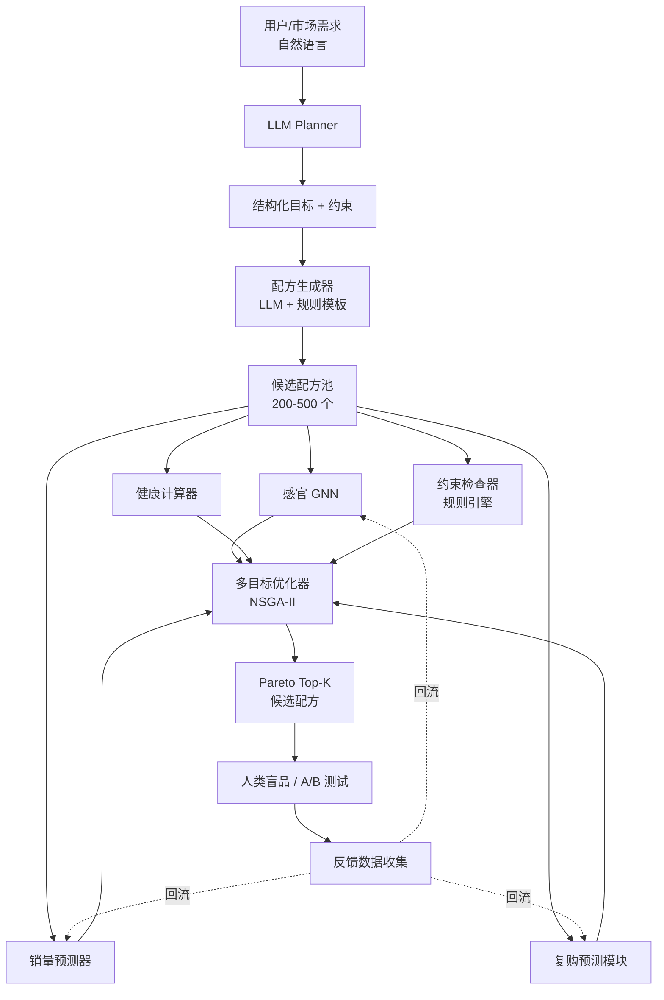

# 茶饮研发闭环 AI 系统 — 技术方案书

> **版本**:v1.4(新增:§E.9 用量先验的灵活化机制 — 闭环可学的 Dirichlet + 配料级 typical_serving)
> **日期**:2026-05-25
> **状态**:草案,待评审
> **目标读者**:项目导师、合作方、开发团队
> **预计周期**:8 周(单人)/ 5–6 周(2 人)完成 v1 闭环

---

## 0. 文档说明

本文档描述了一个面向新式茶饮(奶茶/果茶/纯茶)产品研发的端到端闭环 AI 系统。系统从自然语言形式的市场需求出发,经过 LLM 解析、配方候选生成、多维仿真预测、约束过滤、多目标优化,输出可投产的候选配方,并通过人类盲品 / A/B 测试反馈持续迭代模型。

本方案的核心设计原则:

1. **模块化**:每个模块输入输出标准化,可独立替换升级;
2. **冷启动友好**:不依赖工业生产数据即可启动 v1;
3. **闭环优先**:数据回流通路在 v1 即打通,而不是事后补;
4. **可解释**:健康/约束检查使用确定性规则,仅在感官/销量等"非线性主观"环节使用模型。

---

## 1. 项目背景与目标

### 1.1 行业背景

新式茶饮行业 SKU 上新极频(头部品牌年均 100+),研发周期短(2–4 周/款)、试错成本高(原料采购 + 门店铺货 + 营销预算)。传统流程严重依赖研发师个人经验,**两个核心痛点**:

- **预测能力弱**:某款新品上市前,无法量化预测其感官接受度、销量曲线、复购倾向;
- **多目标冲突难权衡**:好喝、低糖、低成本、原料稳定四个目标互相冲突,人工调配方在 4 维空间里不可能搜得动。

### 1.2 项目目标

构建一个可演示、可量化评估的闭环 AI 系统,满足:

- **G1 端到端**:输入"自然语言需求",输出"Top-K 候选配方 + 各维度预测分数 + 健康标签";
- **G2 可验证**:系统输出的 Top-K 配方,在 20–30 人盲品中,综合喜爱度需显著优于随机基线配方(p < 0.05);
- **G3 数据回流**:盲品/A/B 结果可结构化回流至训练管道,实现增量更新;
- **G4 文档完备**:产出技术报告、代码、复现脚本、demo 视频。

### 1.3 非目标(本期不做)

- 不做实际工业化生产支持;
- 不做用户个性化推荐(系统对象是 SKU,不是个人);
- 不构建独立的复购预测模型(v1 使用代理指标,见 §3.3.3)。

---

## 2. 系统总体架构

### 2.1 架构图



### 2.2 数据流契约

| 接口 | 上游 | 下游 | 数据格式 |
|---|---|---|---|
| 需求结构化 | LLM Planner | 配方生成器 | JSON(目标人群、价格区间、健康约束、风格倾向) |
| 候选配方 | 配方生成器 | 仿真器/约束检查器 | JSON list(每个 = {原料: 克数, 工艺参数, 元数据}) |
| 感官预测 | 感官 GNN | 优化器 | 向量(10–15 维感官分数 + 各维不确定性) |
| 销量预测 | 销量预测器 | 优化器 | 标量(销量贡献残差 + 置信区间) |
| 健康指标 | 健康计算器 | 约束检查器 + 优化器 | JSON(热量/糖/脂/咖啡因/致敏原) |
| 反馈记录 | 盲品 / A/B | 训练管道 | 结构化记录(见 §3.7) |

### 2.3 技术栈

- **核心语言**:Python 3.11
- **GNN**:PyTorch Geometric(GAT / GIN)
- **表格预测**:LightGBM
- **优化器**:Optuna(NSGA-II)+ BoTorch(贝叶斯前沿细化)
- **LLM 调用**:Anthropic Claude API + OpenAI GPT API(用于鲁棒性对比)
- **数据管理**:DuckDB(本地)+ Parquet(原始数据快照)
- **实验追踪**:Weights & Biases
- **部署**:本地 CLI + Gradio Demo

---

## 3. 模块详细设计

### 3.1 模块一:LLM Planner(需求理解)

**职责**:将自然语言需求解析为结构化目标 + 软/硬约束。

**实现**:无需训练,Claude / GPT API + 结构化输出(JSON Schema 强约束)。

**输入示例**:
> "想为夏季年轻女性开发一款主打健康轻负担的茶饮新品,定价 18–22 元"

**输出 JSON Schema**:

```json
{
  "目标人群": {"年龄": "18-30", "性别": "女性", "城市层级": "一二线"},
  "季节": "夏季",
  "口味偏向": ["清爽", "果香", "微甜"],
  "口味禁忌": ["浓郁奶味", "苦"],
  "价格区间_元": [18, 22],
  "健康约束": {
    "含糖上限_g": 25,
    "热量上限_kcal": 200,
    "咖啡因上限_mg": 150,
    "无反式脂肪": true
  },
  "差异化要求": "低负担",
  "原料偏好": {"包含": ["茉莉绿茶", "新鲜水果"], "排除": ["植脂末"]},
  "营销标签建议": ["低卡", "夏日限定"]
}
```

**关键工程要点**:

- 使用 Anthropic 的 tool use / strict JSON 模式确保输出可解析;
- Prompt 中嵌入"茶饮领域术语库"(<200 词)消歧;
- 对于关键约束(健康/价格),用单独 LLM 调用做二次验证(self-consistency)。

### 3.2 模块二:配方生成器(候选生成)

**职责**:在巨大的"原料组合 × 比例 × 工艺"空间中,根据 Planner 输出,采样出 200–500 个语义合理的候选。

**v1 实现:LLM 粗采样 + 规则模板细化**

```
Step 1:LLM 生成 N=50 个粗粒度配方"概念"
        输出:茶底类型、奶基类型、果料组合的离散选择
        Prompt 中提供"成功茶饮范例"作为 in-context examples

Step 2:规则模板将每个概念实例化为连续参数空间的多个采样
        - 糖度:0/30/50/70/100 五档 × 比例微调
        - 茶汤浓度:0.5x – 1.5x 基准
        - 各原料克数:正态扰动(均值 = 行业典型值,σ = 20%)
        - 每个概念展开为 5–10 个具体配方

Step 3:去重(配方距离 < 阈值的视为同一个),输出 200–500 候选
       - 距离定义:Jaccard(原料集合)< 0.2 或 L2(归一化克数向量)< 0.1 → 视为重复
```

**与优化器的关系(关键,v1.0 有歧义)**

生成器输出的 200–500 候选 **不是最终候选池**,而是作为多目标优化器(§3.5)的**初始种群(warm start)**。NSGA-II 从这些种子出发,在 §3.5 定义的搜索空间内继续演化 50 代,最终从演化后的 Pareto 前沿挑 Top-K。

```
LLM/规则 → 200–500 个"种子"配方  ──┐
                                    ├──→  NSGA-II 演化(50代,pop=200)  → Pareto 前沿 → Top-K
搜索空间边界(§3.5 search_space)  ──┘
```

这样做的好处:LLM 引入"语义合理"先验,NSGA-II 负责"在合理流形上做精细多目标权衡",两者职责互补。

**v2 实现(留待数据 ≥ 5000 配方-评分对后)**:

- 配方 VAE / 扩散模型:学习"可行配方"的低维流形,直接在隐空间采样;
- 配方语义嵌入:用 Sentence-Transformer 编码"配方文本描述",检索增强生成。

**配方编码 Schema(关键设计,所有模块共用)**:

```python
@dataclass
class Recipe:
    recipe_id: str
    ingredients: dict[str, float]   # {原料名: 克数 or 毫升}
    process: dict[str, Any]         # {温度, 萃取时间, 摇制次数, ...}
    serving_size_ml: float
    sugar_level: Literal["无糖", "三分", "五分", "七分", "全糖"]
    metadata: dict                  # 季节定位、价格档、标签等
```

### 3.3 模块三:仿真器集合(系统核心)

四个仿真器并行工作,各自输出预测向量后由优化器汇总。

#### 3.3.1 感官 GNN(路径 A + 路径 C 融合)

**职责**:输入配方,输出多维感官预测(甜度、苦度、茶香、奶香、果香、顺滑度、回甘、整体喜爱度等)+ 不确定性。

**数据来源 — 双通路**

**路径 A:大规模噪声标注(预训练用)**

- 爬虫:大众点评、小红书、抖音奶茶相关评论,**目标 5–10 万条**;
- 标注:Claude Haiku API 批量抽取细粒度感官标签:
  ```
  评论: "今天买的桂花乌龙拿铁太苦了,茶味虽然浓但是有点涩,奶感倒挺顺滑"
  抽取: {"苦": 0.85, "茶味": 0.75, "涩": 0.6, "奶味顺滑": 0.7, "喜爱度": 0.3}
  ```
- 配方端:从品牌官方产品页爬取**基础配方**(配料表 + 标准比例)。

**⚠️ 路径 A 的"配方—评论配对"问题(v1.0 未处理)**

评论是关于 `(品牌 SKU, 用户定制选择)` 的组合,而品牌产品页只给基础配方。同一条 SKU 下,用户可能选了"三分糖去冰加芋圆"或"全糖加波霸"——感官完全不同。直接训会让 GNN 学到"品牌 → 评分"而非"配方 → 评分"。

**修法:把输入从"配方 → 评分"改成"(基础配方,定制选项) → 评分"**

```python
# 配方端输入(GNN 节点 + 全局特征)
inputs = {
    "graph": brand_sku_base_recipe_graph,   # 节点 = 原料, 边 = 共存
    "customization": {                       # 全局特征向量,拼接到读出层
        "sugar_level": 0.5,                  # 0/0.3/0.5/0.7/1.0
        "ice_level": 0.3,                    # 无冰/少冰/正常
        "toppings_onehot": [...],            # 用户加料(评论中正则抽取)
        "size": 0.7,                         # 中/大杯
    },
}
```

定制选项从评论文本里用规则 + LLM 二次抽取("我选的三分糖" → sugar_level=0.3)。抽不到的样本标记为"unknown",训练时这部分用 dropout 模拟。残余噪声靠 Stage 2 真实盲品压。

**路径 C:小规模高质量盲品(微调用)**

- 准备 10–15 杯不同配方的实物;
- 招募 20–30 名同学/室友盲评;
- 评分维度:**严格使用"核心 5 维"**——甜度、苦度、茶香、奶香、整体喜爱度;
- 每杯 ≥ 10 人评分(不是原方案的 3–5 人,见 §6.2 样本量论证)→ 100–150 杯·人次。

**⚠️ 路径 A/C 维度对齐(v1.0 未处理)**

路径 A 用 LLM 抽 10–15 维感官,路径 C 只评 5 维;直接 fine-tune 会冲掉另外 10 维信息。

**修法:双层输出头**

```
GNN backbone  →  graph embedding (256d)
                   ├──→  核心 5 维头(双通路共训)
                   │     - 甜度、苦度、茶香、奶香、喜爱度
                   │     - Stage 1 用路径 A 训, Stage 2 用路径 C 微调
                   │
                   └──→  扩展 10 维头(仅路径 A)
                         - 涩、酸、回甘、顺滑、果香、咸、油腻、清新、浓郁、层次
                         - Stage 2 冻结,继承 Stage 1 权重
```

推理时核心 5 维 + 扩展 10 维都输出,送入优化器的目标函数。

**模型结构**

```
输入:配方图
  - 节点 = 原料,带属性向量(成分、口味标签、来源类别 one-hot)
  - 边 = 共存关系,带边特征(质量比、是否经过共同工艺步骤)

Backbone:2–3 层 GAT 或 GIN(消息传递)

读出:Graph-level mean + max pooling

输出头:多任务 MLP
  - 头 1:5–15 维感官分数(均值)
  - 头 2:5–15 维不确定性(对数方差,Heteroscedastic)
```

**两阶段训练**

```
Stage 1 (预训练): 用路径 A 数据
  Loss = MSE(predicted, LLM_aspect) * mask
  - LLM 没抽到的维度不参与 loss
  - 大 batch, 高 dropout (0.3)

Stage 2 (微调): 用路径 C 数据
  Loss = NLL(panel_scores | predicted_mean, predicted_var)
       + λ · 一致性正则(同一配方多人评分方差作为下界)
  - 小 batch, 低学习率, 解冻最后 1 层 GNN + 输出头
  - 早停,验证集 = leave-one-recipe-out 交叉验证
```

**关键风险与对策**(参见 §5)

- 路径 A 标签偏差:知名品牌评论占主导 → 训练时对品牌/价格做加权重采样,均衡覆盖;
- 不确定性校准:预训练阶段过度自信 → Stage 2 使用 NLL loss 显式建模方差。

#### 3.3.2 销量预测器

**职责**:预测新配方相对于"同品类基线"的销量贡献(残差),而非绝对销量。

**特征工程**

| 类型 | 特征 |
|---|---|
| 配方端 | 复用感官 GNN 的 graph embedding(冻结) |
| 价格 | 定价绝对值、相对同品类均价的偏离 |
| 时间/季节 | 上市月份、节日邻近度 |
| 营销 | 联名/限定/明星代言/包装重设计(one-hot,从产品页爬取) |
| 渠道 | 主推平台、首发城市层级 |

**标签**(代理变量,因无真实 POS 数据):

- 大众点评推荐数 / 评论数
- 抖音相关话题播放量
- 上市 30 天小红书笔记数(回溯成熟产品)

**模型 + 因果分离训练(v1.1 修订)**

**v1.0 的问题**:原方案 baseline = f(品类, 价格, 季节, 营销),**没有品牌**。但品牌强相关于配方风格(喜茶多用厚乳,蜜雪冰城多用植脂末),baseline 没控制住品牌,残差里仍背着品牌信号,导致 recipe_model 学到的"配方贡献"实际是"品牌效应"。

**v1.1 修法**:baseline 加品牌固定效应,并用 K 折交叉拟合避免 baseline 在自己样本上过拟合。

```python
# Step 1:baseline 包含品牌 + 其他混淆变量
#         用 K 折交叉拟合(K=5),每折 baseline 只在外部数据上训
#         避免 baseline 在自己样本上过拟合导致残差被吃掉

from sklearn.model_selection import KFold

residuals = np.zeros(N)
for train_idx, val_idx in KFold(n_splits=5).split(X):
    baseline = LightGBM(
        features=[
            品牌_one_hot,         # 关键新增
            品类, 价格, 季节,
            营销标签_one_hot,
            首发城市层级,
        ],
        target=销量代理,
    ).fit(X[train_idx], y[train_idx])
    residuals[val_idx] = y[val_idx] - baseline.predict(X[val_idx])

# Step 2:配方模型拟合残差(同样 K 折)
recipe_model = LightGBM(
    features=[配方 GNN embedding(256d), 工艺参数],
    target=residuals,
)

# 推理:新配方的"配方贡献" = recipe_model.predict(配方特征)
#       绝对销量预测 = baseline(品牌+价格+...) + recipe_contribution
```

> 进阶选项(数据 ≥ 3000 SKU 后):用 EconML 的 `DML` 类做正经的 Double ML,对 Y 和 T 都用控制变量去均值后拟合,理论上更干净。学生项目阶段加品牌固定效应 + K 折交叉拟合已经能去掉绝大部分品牌偏置。

**幸存者偏差(v1.1 补充)**

代理标签(评论数/笔记数)只在"成功被讨论"的产品上有信号,**已下架/失败的 SKU 不在样本里**。这会让模型系统性高估"激进配方"的销量。

缓解:

1. 主动从美团历史快照、品牌微信公众号"下架公告"、第三方比价 App 历史数据补充已下架 SKU(标签 = 极低或 0);
2. 训练时报告"已下架 SKU 占比",作为数据质量元信息;
3. 在评估和论文中明确声明:本模型预测的是"上市后会被讨论的程度",不是"绝对销售额"。

**评估指标**:Spearman ρ(预测 vs 真实销量排名),NDCG@10,以及在已下架 SKU 子集上的 recall(检验是否能识别失败品)。

#### 3.3.3 复购预测模块

**v1(学生阶段):加权组合,不训独立模型**

```python
repurchase_score = α · sensory_gnn.predict(recipe)["喜爱度"]
                 + β · review_signal["会回购意向占比"]  # 来自路径 A
                 + γ · social_decay_slope(产品类别)    # 越平缓越好

# 系数 α/β/γ 用网格搜索 + 少量人类标注(20-30 款已知产品的复购排名)调
```

**v2(POS 数据可得后)**:DeepSurv 或 Sequence Transformer 建模"用户–配方–时间"序列。

**诚实声明**:v1 阶段,本模块本质上是"喜爱度的加权别名"。在论文/报告中需明确说明,不夸大其独立价值。

#### 3.3.4 健康计算器(确定性)

**职责**:基于原料质量,精确计算每杯营养指标。

**数据源**:

- 中国食物成分表(第 6 版)— 基础食材;
- USDA FoodData Central(API)— 进口/特殊原料补全;
- 工业原料 spec sheet — 厚乳、植脂末、糖浆等品牌官方数据(手动整理 ~50 个商品级原料)。

**实现**(纯查表 + 加权,无模型):

```python
def compute_nutrition(recipe: Recipe) -> dict:
    totals = defaultdict(float)
    for ingredient, mass_g in recipe.ingredients.items():
        actual_mass = mass_g * cooking_factor(ingredient)  # 珍珠/芋圆吸水修正
        spec = ingredient_db[ingredient]  # per-100g
        for nutrient, value in spec.items():
            totals[nutrient] += value * actual_mass / 100

    return {
        "energy_kcal": totals["energy_kcal"],
        "sugar_g": totals["sugar_g"],
        "fat_g": totals["fat_g"],
        "trans_fat_g": totals["trans_fat_g"],
        "caffeine_mg": totals["caffeine_mg"],
        "allergens": detect_allergens(recipe),
        "additives": list_additives(recipe),
    }
```

**工作量**:数据库(200 原料 × 30 营养字段)~ 2 人天;代码 ~ 0.5 人天。

### 3.4 模块四:约束检查器

**职责**:在多目标优化前剔除"绝对不可行"的配方,降低搜索空间。

```python
def check_constraints(recipe, predictions, targets) -> list[str]:
    violations = []

    # 法规硬约束
    if predictions["health"]["caffeine_mg"] > 200:
        violations.append("咖啡因超国标上限")
    if predictions["health"]["trans_fat_g"] > 0:
        violations.append("含反式脂肪,违反健康定位")

    # 业务硬约束
    if predictions["health"]["sugar_g"] > targets["sugar_limit"]:
        violations.append(f"含糖 {predictions['health']['sugar_g']:.1f}g 超目标 {targets['sugar_limit']}g")
    if compute_cost(recipe) > targets["cost_ceiling"]:
        violations.append("成本超上限")
    if not is_supply_stable(recipe):
        violations.append("含季节性/供应不稳原料")

    # 致敏原与排除原料
    excluded = set(targets["原料偏好"]["排除"]) & set(recipe.ingredients)
    if excluded:
        violations.append(f"含排除原料:{excluded}")

    return violations
```

**工作量**:~ 30–50 条规则,1 人天完成。

### 3.5 模块五:多目标优化器

**职责**:在合规候选中找到 Pareto 前沿,输出 Top-K 多样化候选。

**v1.1 关键修订**:
1. 明确"目标函数用 LCB/UCB 而非均值"(否则 NSGA-II 会被 OOD 区域的"高均值预测"钓走);
2. 明确混合离散/连续空间的处理(`pymoo` 默认 NSGA-II 对类别变量是坏的);
3. 明确生成器输出作为 NSGA-II 的**初始种群**(warm start),不是固定池(详见 §3.2 末尾)。

**目标函数(不确定性感知,LCB/UCB 形式)**

```python
# 各仿真器输出 (mean, std);κ 控制保守程度
# κ=0 → 纯均值优化(v1.0 行为, OOD 危险)
# κ=1.96 → 95% 置信下界, 保守
# κ=0.5–1.0 → 学生项目推荐区间

KAPPA = 1.0

objectives = [
    # 喜爱度:最大化 → 优化 LCB μ-κσ → NSGA-II 取负
    -(pref_mean - KAPPA * pref_std),

    # 销量贡献:最大化 → 优化 LCB
    -(sales_mean - KAPPA * sales_std),

    # 成本:最小化 → 优化 UCB μ+κσ(成本是确定性计算, std=0, 退化为均值)
    cost_mean,

    # 含糖:最小化 → 健康计算器也是确定性, std=0
    sugar_g,
]
```

GNN 的不确定性(σ)是 §3.3.1 异方差输出头给的;销量预测的 σ 用 LightGBM 分位数回归(0.05/0.5/0.95 分位)估。

**搜索空间(混合离散 + 连续)**

```python
search_space = {
    "tea_type": Categorical(["乌龙", "红茶", "绿茶", "茉莉", ...]),
    "tea_concentration_x": Real(0.3, 1.5),
    "milk_type": Categorical(["全脂奶", "厚乳", "燕麦奶", "无奶", ...]),
    "milk_mass_g": Real(0, 200),
    "sugar_g": Real(0, 40),
    "fruit_pulp_g": Real(0, 100),
    "topping": Categorical(["珍珠", "芋圆", "椰果", "无", ...]),
    ...
}
```

**算法(v1.1 修订)**

`pymoo`/`optuna` 的默认 NSGA-II 对类别变量直接当数字插值,会产出大量无效个体。**必须用混合变量的专用实现**:

```python
from pymoo.algorithms.moo.nsga2 import NSGA2
from pymoo.core.mixed import MixedVariableGA, MixedVariableMating
from pymoo.operators.crossover.sbx import SBX
from pymoo.operators.mutation.pm import PM
from pymoo.operators.crossover.ux import UX
from pymoo.operators.mutation.rm import ChoiceRandomMutation

algorithm = MixedVariableGA(
    pop_size=200,
    survival=RankAndCrowding(),  # NSGA-II 选择
    mating=MixedVariableMating(
        eliminate_duplicates=MixedVariableDuplicateElimination(),
        crossover={Real: SBX(), Choice: UX()},
        mutation={Real: PM(eta=20), Choice: ChoiceRandomMutation()},
    ),
)
```

- 主干:`MixedVariableGA` + NSGA-II 选择,pop_size=200,generations=50
- 初始种群:§3.2 生成器输出的 200–500 个候选(去重后填进 X_0)
- 在 Pareto 前沿上用 BoTorch 的 `qParEGO`(支持混合空间)做局部贝叶斯细化(每个前沿点 +3 局部样本)
- **多样性约束**:Top-K 输出前在配方 GNN embedding 空间做 MMR
  ```python
  # MMR(Maximal Marginal Relevance):平衡"分数高"和"互相差异大"
  selected = []
  candidates = pareto_front.copy()
  while len(selected) < K:
      scores = []
      for cand in candidates:
          relevance = -cand.objective_sum   # 综合分数
          diversity = min(emb_dist(cand, s) for s in selected) if selected else INF
          scores.append(0.6 * relevance + 0.4 * diversity)
      pick = candidates[argmax(scores)]
      selected.append(pick)
      candidates.remove(pick)
  ```
- **硬多样性补丁**:强制 Top-K 在"主茶底类型"上至少覆盖 3 种,在"奶基类型"上至少覆盖 2 种(避免 5 个都是"乌龙厚乳"系)。

**输出**:Top-K(K=5–10)候选配方 + 各自的均值预测 + 95% 置信区间 + GNN embedding 距离矩阵(给品鉴小组看为何选这 K 个)。

### 3.6 模块六:人类品鉴 / A/B 测试

**学生项目版本(本期目标)**:

```
1. Top-5 候选配方 + 2 个对照(随机基线 + 当下热销产品复刻)
2. 实物制作(实验厨房或家庭厨房)
3. 20–30 人盲品,杯子贴匿名编号
4. 评分:用与感官 GNN 相同的 5 维度 + 整体喜爱度
5. 数据录入到结构化记录(见 §3.7)
```

**工业版本**(展望):

- 选定 3–5 家门店,小批量试产,A/B 测试 2–4 周;
- 收集真实销量、复购率、评论文本、复购用户画像。

### 3.7 模块七:反馈收集 + 模型更新(闭环关键)

**结构化反馈记录**(写入 DuckDB):

```python
feedback_record = {
    "session_id": "...",
    "recipe": recipe_object,
    "predicted": {
        "sensory": {dim: {"mean": ..., "var": ...}},
        "sales_residual": ...,
        "repurchase_score": ...,
        "health": {...},
    },
    "actual": {
        "sensory_scores": [{"panelist": ..., "scores": {...}}],
        "actual_sales": None,  # 或真实数据
        "comments": [...],
    },
    "context": {"season": ..., "store": ..., "test_date": ...},
    "timestamp": ...,
}
```

**模型更新策略**

| 模块 | 更新频率 | 方式 |
|---|---|---|
| 感官 GNN | 每周/月 | 增量微调(新数据 + 旧数据均衡采样)+ 主动学习(优先采集模型不确定性高的样本) |
| 销量预测器 | 每月 | 全量重训(数据量不大) |
| 健康计算器 | 不更新 | 规则确定 |
| 复购模块 | 积累 ≥ 5000 样本后 | 从加权公式升级为独立模型 |
| **配方生成器:Dirichlet α**(v1.4 新增) | 每轮盲品后 | 共轭 Bayesian 后验更新(见 §E.9),从"风格平均比例"逐步学到"特定风格 × 上下文"的最优配比 |
| **配方生成器:typical_serving_g**(v1.4 新增) | 每月 | 用"高评分配方"的实际用量加权平均刷新词表;σ 也同步更新 |
| **配料相容矩阵**(v1.4 新增) | 季度 | 用 GNN embedding 距离 + 评分数据挖掘新的高分组合;低分组合降权 |

---

## 4. 数据方案

### 4.1 数据需求总览

| 模块 | 数据类型 | 量级 | 获取难度 | 启动周期 |
|---|---|---|---|---|
| LLM Planner | 无需训练 | – | 无 | 即刻 |
| 配方生成器 v1 | 无需训练(prompt) | – | 无 | 即刻 |
| 感官 GNN 路径 A | 评论 + LLM 抽 aspect | 5–10 万条 | 中(爬虫) | 1–2 周 |
| 感官 GNN 路径 C | 实物盲品 | 200–300 条 | 中(组织) | 2–3 周 |
| 销量预测器 | 公开热度数据 + 配方 | 1000+ 产品 | 中(爬虫) | 1–2 周 |
| 复购模块 v1 | 复用其他模块输出 | – | 无 | 即刻 |
| 健康计算器 | 食物成分表 + spec sheet | 200 原料 | 易(公开) | 1–2 天 |
| 约束检查器 | 监管文档 + 业务规则 | 几十条 | 易 | 1–2 天 |
| 优化器 | 无需训练 | – | 无 | 即刻 |

### 4.2 数据采集计划

**评论数据(路径 A)**

- 平台:大众点评(餐厅评论)、小红书(笔记)、抖音(短视频评论);
- 关键词:覆盖 Top 20 茶饮品牌 × Top 50 单品名;
- 工具:`playwright` + 反爬规避;
- 合规:仅采集公开内容,不涉及用户隐私,匿名化处理。

**配方/产品页(销量端)**

- 来源:品牌小程序、官网、第三方比价 App;
- 字段:产品名、配料表、规格、价格、上市日期、营销标签。

**实物盲品(路径 C)**

- 配方选取:5 种风格各 2–3 杯,共 10–15 杯;
- 招募:目标人群匹配的同学/室友;
- 流程:杯子编号 → 盲品 → 评分表 → 录入。

### 4.3 数据质量控制

- **去重**:配方哈希、评论文本 MinHash;
- **抽样审计**:每周抽查 50 条 LLM 抽取的 aspect,与人工标注对比一致性(目标 ≥ 80%);
- **冲突解决**:多人评分使用中位数 + 异常值标记,而非简单平均;
- **数据版本**:每次模型训练前打 snapshot(Parquet + git LFS)。

---

## 5. 关键技术风险与缓解

| 风险 | 影响 | 缓解措施 |
|---|---|---|
| **R1 路径 A 标签偏差**:评论严重偏向已火 SKU,GNN 学到"知名品牌 → 高分"捷径 | 感官预测失真 | 训练时按品牌/价格做加权重采样;Stage 2 用人类盲品强校准;诚实报告 Stage 1 单独表现以暴露问题 |
| **R2 复购 v1 无真实标签** | α/β/γ 难调,可能是喜爱度的别名 | 公开承认 v1 局限;用"已知热销/失败产品"的复购排名做弱监督校准;不夸大独立价值 |
| **R3 Pareto 前沿多样性不足**:NSGA-II 易输出近邻解 | Top-K 缺乏多样性,人工试品意义打折 | 在 embedding 空间做 MMR;强制 Top-K 在主茶底/奶基类别上覆盖差异(§3.5) |
| **R4 闭环冷启动偏置**:首轮仿真器弱,Top-K 不一定真好,易自我强化错误 | 闭环"看起来"在收敛实际在跑偏 | 首轮必须有"随机基线 + 专家配方"对照盲品;系统输出仅"显著优于随机"才宣告收敛 |
| **R5 路径 C 数据量偏小**:200–300 条 × 5–15 维多任务 | 多任务回归不稳定 | 砍维度到 5 个核心 + 10 维 LLM-only;双层输出头(§3.3.1);Stage 2 leave-one-recipe-out 交叉验证 |
| **R6 健康数据库覆盖不全**:工业原料(厚乳、植脂末等品牌差异大) | 健康指标系统性偏差 | 标注每个原料的"数据来源等级"(spec sheet > 公开数据库 > 估算);未覆盖原料触发警告 |
| **R7 LLM 抽 aspect 不稳定**:不同 prompt 抽出值差 0.1–0.3 | 训练标签噪声 | self-consistency(3 次抽取取中位数);定期审计;关键维度的 prompt 锁版本 |
| **R8 配方—评论配对失真**(v1.1 新增):评论实际对应"基础配方 + 用户定制",但定制选项常缺失 | GNN 学到"品牌 → 评分"而非"配方 → 评分" | 把定制选项作为显式输入特征,从评论文本规则+LLM 二次抽取;抽不到的样本用 dropout 模拟 unknown(§3.3.1) |
| **R9 优化器被 OOD 区域钓走**(v1.1 新增):NSGA-II 用预测均值,会推到训练分布外"高均值幻觉"区 | Pareto 前沿不可信 | 目标函数用 LCB/UCB 而非均值,κ=1.0;OOD 预测因方差大被惩罚(§3.5) |
| **R10 销量预测被品牌效应污染**(v1.1 新增):v1.0 的因果分离 baseline 未含品牌,残差仍背品牌信号 | recipe_model 学的是品牌不是配方 | baseline 加品牌固定效应 + K 折交叉拟合;数据多后升级 Double ML(§3.3.2) |
| **R11 销量代理的幸存者偏差**(v1.1 新增):只看到上市后被讨论的 SKU,失败品不在样本里 | 模型系统性高估激进配方销量 | 主动补充已下架/失败 SKU 列表;声明本模型预测"被讨论的程度"而非绝对销售额(§3.3.2) |
| **R12 混合空间优化算子默认不工作**(v1.1 新增):`pymoo`/`optuna` 默认 NSGA-II 对类别变量当数字插值 | 大量无效个体,演化失败 | 用 `pymoo.MixedVariableGA` + 类别专用算子(`UX`/`ChoiceRandomMutation`)(§3.5) |

---

## 6. 评估方案

### 6.1 模块级指标

| 模块 | 指标 | 目标 |
|---|---|---|
| LLM Planner | JSON 解析成功率;关键约束召回率 | ≥ 95% / ≥ 90% |
| 感官 GNN(路径 C 测试集) | 各维度 Pearson r;喜爱度 RMSE | r ≥ 0.6;RMSE ≤ 1.0(5 分量表) |
| 感官 GNN 不确定性校准 | Reliability diagram ECE | ECE ≤ 0.1 |
| 销量预测器 | Spearman ρ;NDCG@10 | ρ ≥ 0.4(代理指标天花板有限) |
| 健康计算器 | 与第三方实测对比(委外 1–2 个样本) | 含糖/热量误差 ≤ 10% |
| 优化器 | Pareto 前沿超体积(hypervolume);Top-K 多样性 | 相对随机搜索 ≥ 2× |

### 6.2 系统级指标(G2,v1.1 重新设计)

**v1.0 的统计设计问题**:
1. 配对 t 检验假设 Likert 数据正态分布,**违反前提**;
2. 6 个维度同时比较没做多重比较校正;
3. 7 杯/人对茶饮(单宁累积)会导致严重味觉疲劳,后几杯评分不可信;
4. 没说顺序如何随机,前几杯影响后几杯;
5. 20 人 × 3 between-subjects 组的统计功效不足以检出中等效应(d=0.5,Wilcoxon,需 n ≥ 35)。

**v1.1 修订后的主试验设计**

**Design:平衡不完全区组 + within-subjects**

- 总杯数:**21 杯**
  - A 组(系统 Top-7):7 杯
  - B 组(随机基线,从合规空间均匀采样):7 杯
  - C 组(专家对照:5 市售热销 + 2 研发同学手调):7 杯
- 评委:**35 人**(由 §6.2.4 power analysis 决定下限)
- 每人评 6 杯(每组 2 杯),保证每杯被 ≥ 10 人评(平衡 BIBD,balanced incomplete block design)
- 分 2 场,每场 3 杯,中间 ≥ 1 天间隔
- 杯间隔 5 分钟,温水 + 苏打饼干清口
- **Latin square 顺序随机化**,平衡 carry-over 效应
- 评分:核心 5 维感官 + 整体喜爱度;Likert 1–5;杯子盲编号

**统计检验**

```python
# 主要指标:A 组 vs B 组的整体喜爱度
# 用 Wilcoxon signed-rank(评委内配对),不是 t-test
from scipy.stats import wilcoxon
W, p_main = wilcoxon(scores_A, scores_B, alternative='greater')
# 通过阈值:p_main < 0.05(主要假设, 不参与多重校正)

# 次要指标:A 组 vs C 组(达到"接近专家")
# 等价性检验(TOST),边界 = 0.5 Likert
from scipy.stats import ttest_rel  # TOST 用 t 即可, 因为关心的是非劣

# 多维度差异分析(5 维感官):Friedman 检验 + Nemenyi 后置
from scipy.stats import friedmanchisquare
# 6 个维度 → Bonferroni 校正 α = 0.05/6 = 0.0083

# 多评委 × 多杯的嵌套结构:线性混合效应模型
import statsmodels.formula.api as smf
model = smf.mixedlm("score ~ group", df,
                    groups=df["panelist_id"],   # 评委作随机效应
                    re_formula="~1")            # 随机截距
result = model.fit()
```

**报告内容**:除 p 值外,**必须报告效应量**(Cohen's d 或 rank-biserial correlation r),否则统计显著但效应微小没意义。

**样本量与统计功效论证**

```
研究问题:A 组喜爱度均值 > B 组均值
假设:中等效应量 Cohen's d = 0.5
显著性水平:α = 0.05(单侧)
功效:1 - β = 0.80
检验:Wilcoxon signed-rank(配对设计)

计算(G*Power 或 statsmodels):
  paired Wilcoxon, d=0.5, α=0.05, power=0.80
  → n_对 ≈ 34

结论:至少需要 35 名评委,每人提供 A/B 各一对评分
```

**风险弱化**:若实际效应小于 d=0.5(系统首次跑通时常见),需要把 d 调到 0.35 重算 → n ≈ 67。若资源不够,降低 power 到 0.7 → n ≈ 28(但接受更高的"漏报"风险)。

### 6.3 消融实验

| 消融项 | 验证的假设 |
|---|---|
| 去掉路径 A 预训练 | 大规模噪声预训练有效 |
| 去掉因果分离训练(销量端) | 残差训练避免 confounder |
| 去掉 MMR 多样性约束 | 多样性约束改善人类品鉴体验 |
| LLM Planner 换成简单关键词解析 | LLM 解析对下游有增益 |

---

## 7. 实施路线图

### 7.1 阶段划分(8 周,单人)

**Phase 1(Week 1–2):打地基**

- [ ] 搭原料数据库(200 原料 × 30 营养字段)
- [ ] 实现健康计算器、约束检查器(纯规则,无模型)
- [ ] 定义配方编码 Schema、反馈记录 Schema
- [ ] 启动评论数据爬取(后台运行)
- [ ] 搭实验追踪基础(W&B 项目、DuckDB 库)

**Phase 2(Week 3–4):仿真器 v1**

- [ ] 训感官 GNN 路径 A 预训练(评论数据 + LLM 抽 aspect)
- [ ] 训销量预测器(LightGBM + 因果分离)
- [ ] 实现复购模块 v1(加权公式)
- [ ] 每模块单元测试 + 模块级评估指标

**Phase 3(Week 5–6):跑通 pipeline**

- [ ] 接入 LLM Planner(JSON Schema 模式)
- [ ] 接入配方生成器(LLM + 规则模板)
- [ ] 集成多目标优化器(NSGA-II + MMR)
- [ ] 端到端 demo:CLI + Gradio 网页
- [ ] 跑通 3–5 个不同需求场景,产出可视化报告

**Phase 4(Week 7–8):闭环验证 + 收尾**

- [ ] 组织 20–30 人盲品(系统 Top-5 + 随机基线 + 专家对照)
- [ ] 用盲品数据微调感官 GNN(Stage 2)
- [ ] 统计显著性检验,产出主试验结果
- [ ] 写技术报告 / 项目文档 / 录 demo 视频

### 7.2 关键里程碑(用于汇报)

| 周末 | 里程碑 | 可演示物 |
|---|---|---|
| Week 2 | 数据/规则地基完成 | 输入一杯配方 → 输出营养标签 + 约束检查结果 |
| Week 4 | 仿真器 v1 完成 | 输入一杯配方 → 输出感官预测 + 销量分数 |
| Week 6 | 端到端 pipeline 跑通 | 自然语言需求 → Top-5 候选配方报告 |
| Week 8 | 闭环验证完成 | 盲品试验报告 + 统计显著性证明 |

### 7.3 工作量估算(人天)

| 阶段 | 人天 | 关键瓶颈 |
|---|---|---|
| Phase 1 | 8–10 | 原料数据库手工整理 |
| Phase 2 | 10–14 | GNN 训练调优 |
| Phase 3 | 8–10 | pipeline 接口对齐 |
| Phase 4 | 8–12 | 盲品组织 + 物料采购 |
| **合计** | **34–46 人天** | — |

> 单人 8 周 ≈ 40 工作日,刚好覆盖;若 2 人协同,关键路径可压缩到 5–6 周(数据采集与模型训练并行)。

---

## 8. 交付物

### 8.1 代码

- `beverage_ai/` Python 包,包含全部 7 个模块
- `scripts/` 数据采集、训练、推理脚本
- `tests/` 单元测试 + 集成测试
- `demo/` Gradio 网页 demo

### 8.2 数据

- `data/ingredients.parquet` 原料数据库
- `data/reviews_v1.parquet` 评论数据(脱敏)
- `data/products_v1.parquet` 产品数据
- `data/panel_v1.parquet` 盲品评分数据
- `models/` 训练好的权重(GNN + LGB)

### 8.3 文档

- 本技术方案书(v1.0)
- 实验报告(含盲品统计结果)
- 复现指南(README.md)
- Demo 视频(5–10 分钟)

---

## 附录 A:配方编码 Schema 完整示例

```python
example_recipe = Recipe(
    recipe_id="R_2026_05_001",
    ingredients={
        "茉莉绿茶汤": 250.0,    # ml
        "厚乳": 80.0,           # ml
        "白砂糖": 15.0,         # g
        "鲜柠檬汁": 10.0,       # ml
        "冰块": 80.0,           # g
    },
    process={
        "茶汤萃取温度_C": 85,
        "茶汤萃取时间_s": 180,
        "摇制次数": 15,
        "出品温度_C": 4,
    },
    serving_size_ml=500,
    sugar_level="五分",
    metadata={
        "季节定位": "夏季",
        "价格档_元": 20,
        "营销标签": ["低卡", "鲜果"],
    },
)
```

## 附录 B:关键参考资料

- 中国食物成分表(标准版)第 6 版
- USDA FoodData Central, https://fdc.nal.usda.gov
- Veličković et al., *Graph Attention Networks*, ICLR 2018
- Deb et al., *A Fast and Elitist Multiobjective Genetic Algorithm: NSGA-II*, IEEE TEVC 2002
- Bishop, *Mixture Density Networks*(异方差不确定性建模参考)

---

## 附录 D:奶茶原料可选全集词汇表(v1.2 新增)

### D.1 设计目的

本词表是 §3.3.4 健康计算器、§3.3.1 感官 GNN 节点表、§3.5 优化器搜索空间的**共享单一真源**(single source of truth)。

- **总量**:约 200 条,覆盖 2024–2026 中国新式茶饮主流原料
- **存储**:`data/ingredient_vocab.yaml`,所有模块从此处加载,禁止散落硬编码
- **范围**:工程实用集合(覆盖头部 30 个品牌的绝大多数 SKU),不追求穷举
- **不在范围内**:酒精饮料、咖啡专门店深度 SKU、地方性极小众原料
- **扩展机制**:见 §D.5

### D.2 类别框架

| 类别 | id 前缀 | 数量 | 备注 |
|---|---|---|---|
| 茶底 | `tea_` | 30 | 红 / 绿 / 乌龙 / 普洱 / 白 / 花 / 草本代茶 |
| 动物奶基 | `dairy_` | 14 | 鲜奶 / 厚乳 / 淡奶 / 奶油 / 奶盖 / 酸奶 |
| 植物奶基 | `alt_milk_` | 9 | 燕麦 / 杏仁 / 椰 / 豆 / 米 / 植脂末 |
| 咖啡基 | `coffee_` | 8 | 浓缩 / 冷萃 / 美式 / 速溶 / 豆 |
| 甜味剂 | `sweet_` | 19 | 蔗糖类 / 糖浆类 / 代糖类 |
| 水果 | `fruit_` | 44 | 主水果 38 + 加工形态 6 |
| 配料 / 小料 | `topping_` | 30 | 珍珠 / 芋圆 / 仙草 / 椰果 / 布丁 |
| 风味 / 香料 / 酱料 | `flavor_` | 27 | 酱料 / 粉末 / 香精 / 盐 / 干花 |
| 基础辅料 | `aux_` | 10 | 冰 / 水 / 苏打 |
| 凝胶 / 增稠 | `gel_` | 8 | 寒天 / 明胶 / 胶质 |
| 谷物 / 籽实 | `grain_` | 8 | 奇亚 / 罗勒 / 燕麦 |
| **合计** | — | **~207** | 留 ~15 条 buffer 用于客户化扩展 |

### D.3 完整词表

#### D.3.1 茶底(`tea_`,30 条)

**红茶类**

`tea_assam` 阿萨姆红茶 · `tea_ceylon` 锡兰红茶 · `tea_dianhong` 滇红 · `tea_lapsang` 正山小种 · `tea_keemun` 祁门红茶 · `tea_yingde` 英德红茶 · `tea_earlgrey` 伯爵红茶(含佛手柑) · `tea_uva` 乌瓦

**绿茶类**

`tea_longjing` 龙井 · `tea_biluochun` 碧螺春 · `tea_maofeng` 黄山毛峰 · `tea_maojian` 信阳毛尖 · `tea_gyokuro` 玉露 · `tea_jasmine_green` 茉莉绿茶 · `tea_matcha` 抹茶 · `tea_sencha` 蒸青煎茶

**乌龙类**

`tea_tieguanyin` 铁观音 · `tea_dahongpao` 大红袍 · `tea_dancong` 凤凰单丛(含蜜兰香 / 鸭屎香 / 八仙) · `tea_dongding` 冻顶乌龙 · `tea_jinxuan` 金萱 · `tea_sijichun` 四季春 · `tea_osmanthus_oolong` 桂花乌龙 · `tea_highmtn_oolong` 高山乌龙

**普洱 / 白茶**

`tea_pu_raw` 生普 · `tea_pu_ripe` 熟普 · `tea_baihao` 白毫银针 · `tea_baimudan` 白牡丹 · `tea_shoumei` 寿眉

**花茶 / 草本代茶**

`tea_jasmine` 茉莉花茶 · `tea_rose` 玫瑰花茶 · `tea_osmanthus` 桂花茶 · `tea_hibiscus` 洛神花 · `tea_chrysanthemum` 菊花 · `tea_mint` 薄荷 · `tea_barley` 大麦茶 · `tea_buckwheat` 荞麦茶 · `tea_cassia` 决明子 · `tea_lemongrass` 柠檬草 · `tea_luohanguo` 罗汉果茶

#### D.3.2 动物奶基(`dairy_`,14 条)

`dairy_whole_milk` 全脂鲜奶 · `dairy_lowfat_milk` 低脂鲜奶 · `dairy_skim_milk` 脱脂鲜奶 · `dairy_thick_milk` 厚乳(乳脂 ≥ 5%) · `dairy_evap_milk` 淡奶 · `dairy_condensed` 炼乳 · `dairy_heavy_cream` 重奶油(35%+ 乳脂) · `dairy_light_cream` 淡奶油(18–30% 乳脂) · `dairy_milk_powder_whole` 全脂奶粉 · `dairy_milk_powder_skim` 脱脂奶粉 · `dairy_cheese_foam` 芝士奶盖 · `dairy_seasalt_foam` 海盐奶盖 · `dairy_yogurt` 酸奶 · `dairy_greek_yogurt` 希腊酸奶

#### D.3.3 植物奶基(`alt_milk_`,9 条)

`alt_milk_oat` 燕麦奶 · `alt_milk_oat_barista` 燕麦奶咖啡师版 · `alt_milk_almond` 杏仁奶 · `alt_milk_coconut` 椰奶 · `alt_milk_coconut_cream` 椰浆 · `alt_milk_soy` 豆奶 · `alt_milk_rice` 米奶 · `alt_milk_cashew` 腰果奶 · `alt_milk_creamer` 植脂末(含氢化植物油,⚠️ 反式脂肪风险)

#### D.3.4 咖啡基(`coffee_`,8 条)

`coffee_espresso` 意式浓缩 · `coffee_coldbrew` 冷萃 · `coffee_americano` 美式 · `coffee_instant` 速溶粉 · `coffee_concentrate` 咖啡液 · `coffee_drip` 挂耳 · `coffee_bean_arabica` 阿拉比卡咖啡豆 · `coffee_bean_robusta` 罗布斯塔咖啡豆

#### D.3.5 甜味剂(`sweet_`,19 条)

**蔗糖类**

`sweet_cane_sugar` 白砂糖 · `sweet_rock_sugar` 冰糖 · `sweet_brown_sugar` 红糖 · `sweet_dark_brown` 黑糖 · `sweet_powdered_sugar` 糖粉

**糖浆类**

`sweet_fructose_syrup` 果糖糖浆(F55/F42) · `sweet_corn_syrup` 玉米糖浆 · `sweet_dark_syrup` 黑糖糖浆 · `sweet_caramel_syrup` 焦糖糖浆 · `sweet_maple_syrup` 枫糖浆 · `sweet_agave_syrup` 龙舌兰糖浆 · `sweet_osmanthus_honey` 桂花蜜 · `sweet_honey` 蜂蜜

**代糖类**

`sweet_erythritol` 赤藓糖醇 · `sweet_monkfruit` 罗汉果糖苷 · `sweet_stevia` 甜菊糖苷 · `sweet_allulose` 阿洛酮糖 · `sweet_maltitol` 麦芽糖醇 · `sweet_sucralose` 三氯蔗糖

#### D.3.6 水果(`fruit_`,44 条)

**柑橘类**

`fruit_lemon` 柠檬 · `fruit_lime` 青柠 · `fruit_perfume_lemon` 香水柠檬 · `fruit_yellow_lemon` 黄柠檬 · `fruit_orange` 橙子 · `fruit_blood_orange` 血橙 · `fruit_grapefruit` 葡萄柚 · `fruit_kumquat` 金桔 · `fruit_yougan` 油柑

**热带**

`fruit_mango` 芒果 · `fruit_keitt_mango` 凯特芒 · `fruit_green_mango` 大青芒 · `fruit_pineapple` 菠萝 · `fruit_passion` 百香果 · `fruit_coconut_meat` 椰肉 · `fruit_dragon_white` 白心火龙果 · `fruit_dragon_red` 红心火龙果 · `fruit_sugarapple` 释迦 · `fruit_guava` 芭乐 / 番石榴 · `fruit_durian` 榴莲

**浆果**

`fruit_strawberry` 草莓 · `fruit_blueberry` 蓝莓 · `fruit_raspberry` 树莓 · `fruit_mulberry` 桑葚 · `fruit_blackcurrant` 黑加仑 · `fruit_cranberry` 蔓越莓

**核果**

`fruit_peach` 桃子 · `fruit_yellow_peach` 黄桃 · `fruit_honey_peach` 水蜜桃 · `fruit_nectarine` 油桃 · `fruit_cherry` 樱桃 · `fruit_bing_cherry` 车厘子 · `fruit_plum` 李子

**其他**

`fruit_apple` 苹果 · `fruit_pear` 梨 · `fruit_grape` 葡萄 · `fruit_shine_muscat` 阳光玫瑰 · `fruit_banana` 香蕉 · `fruit_kiwi` 猕猴桃 · `fruit_avocado` 牛油果 · `fruit_watermelon` 西瓜 · `fruit_hami_melon` 哈密瓜 · `fruit_longan` 桂圆 · `fruit_lychee` 荔枝 · `fruit_bayberry` 杨梅

**水果加工形态(以上每种水果可附 6 种形态 tag)**

`form_fresh_cut` 鲜果块 · `form_fresh_juice` 鲜榨汁 · `form_puree` 果泥 · `form_jam` 果酱 · `form_freeze_dried` 冻干 · `form_preserved` 蜜渍

#### D.3.7 配料 / 小料(`topping_`,30 条)

**珍珠类**

`topping_brown_pearl` 黑糖珍珠 · `topping_white_pearl` 白珍珠 · `topping_boba` 波霸(大颗珍珠) · `topping_crystal_pearl` 水晶珍珠 · `topping_pop_mango` 爆爆珠-芒果 · `topping_pop_grape` 爆爆珠-葡萄 · `topping_pop_strawberry` 爆爆珠-草莓 · `topping_pop_lychee` 爆爆珠-荔枝

**芋圆 / 根茎**

`topping_taro_ball` 芋圆 · `topping_purple_potato_ball` 紫薯圆 · `topping_potato_ball` 地瓜圆 · `topping_mixed_ball` 五彩芋圆 · `topping_taro_paste` 芋泥 · `topping_purple_potato_paste` 紫薯泥

**仙草 / 果冻**

`topping_grass_jelly` 仙草冻 · `topping_hot_grass_jelly` 烧仙草 · `topping_nata_de_coco` 椰果 · `topping_agar_jelly` 寒天冻 · `topping_konjac` 蒟蒻 · `topping_coffee_jelly` 咖啡冻 · `topping_matcha_jelly` 抹茶冻

**豆类 / 谷物**

`topping_red_bean` 红豆 · `topping_sweet_bean` 蜜豆 · `topping_sago` 西米 · `topping_oats` 燕麦 · `topping_black_sesame` 黑芝麻

**布丁 / 啵啵**

`topping_egg_pudding` 鸡蛋布丁 · `topping_caramel_pudding` 焦糖布丁 · `topping_matcha_pudding` 抹茶布丁 · `topping_crispy_pop` 脆啵啵 · `topping_milk_pop` 奶啵啵

#### D.3.8 风味 / 香料 / 酱料(`flavor_`,27 条)

**酱料**

`flavor_osmanthus_sauce` 桂花酱 · `flavor_rose_sauce` 玫瑰酱 · `flavor_chocolate_sauce` 巧克力酱 · `flavor_caramel_sauce` 焦糖酱 · `flavor_strawberry_jam` 草莓酱 · `flavor_blueberry_jam` 蓝莓酱 · `flavor_salted_caramel` 海盐焦糖酱

**粉末**

`flavor_matcha_powder` 抹茶粉 · `flavor_matcha_stone` 石臼抹茶 · `flavor_cocoa_powder` 可可粉 · `flavor_chocolate_powder` 巧克力粉 · `flavor_cinnamon_powder` 肉桂粉 · `flavor_ginger_powder` 姜粉 · `flavor_vanilla_powder` 香草粉 · `flavor_coconut_milk_powder` 椰浆粉 · `flavor_purple_potato_powder` 紫薯粉

**香精 / 萃取**

`flavor_vanilla_extract` 香草精 · `flavor_almond_extract` 杏仁精 · `flavor_rose_water` 玫瑰水 · `flavor_osmanthus_essence` 桂花精 · `flavor_mint_essence` 薄荷精油

**盐 / 调味**

`flavor_sea_salt` 海盐 · `flavor_cream_salt` 奶盖盐 · `flavor_rose_salt` 玫瑰盐

**干花 / 香草**

`flavor_dried_osmanthus` 干桂花 · `flavor_dried_rose` 干玫瑰花瓣 · `flavor_dried_lavender` 干薰衣草

#### D.3.9 基础辅料(`aux_`,10 条)

`aux_ice_cube` 冰块 · `aux_crushed_ice` 碎冰 · `aux_smoothie_ice` 冰沙 · `aux_shake_ice` 雪克冰 · `aux_pure_water` 纯净水 · `aux_soda_water` 苏打水 · `aux_sparkling_water` 气泡水 · `aux_coconut_water` 椰子水 · `aux_milk_ice` 牛奶冰块 · `aux_tea_ice` 茶冰块

#### D.3.10 凝胶 / 增稠剂(`gel_`,8 条)

`gel_agar` 寒天粉 · `gel_gelatin` 明胶粉 · `gel_fish_gelatin` 鱼胶粉 · `gel_pectin` 果胶 · `gel_carrageenan` 卡拉胶 · `gel_xanthan` 黄原胶 · `gel_tapioca_starch` 木薯粉 · `gel_corn_starch` 玉米淀粉

#### D.3.11 谷物 / 籽实(`grain_`,8 条)

`grain_chia` 奇亚籽 · `grain_basil_seed` 罗勒籽 · `grain_flax` 亚麻籽 · `grain_rolled_oats` 燕麦片 · `grain_instant_oats` 即食燕麦 · `grain_black_rice` 黑米 · `grain_brown_rice` 糙米 · `grain_millet` 小米

### D.4 词条 enrichment schema

每条词目在 `ingredient_vocab.yaml` 中按以下结构存储,供所有下游模块查询:

```yaml
- id: tea_jinxuan
  name_zh: 金萱乌龙
  name_en: Jin Xuan Oolong
  category: tea_base
  subcategory: oolong
  default_form: brewed_tea_ml          # 标准化呈现形态
  typical_serving_g: 200                # 单杯典型用量
  allergens: []                         # 致敏原 tag(milk/nut/soy/gluten/...)
  cost_tier: medium                     # low / medium / high / premium
  supply: stable                        # stable / seasonal / volatile
  shelf_life_days: 365                  # 干茶常温
  nutrition_per_100g:                   # 接 §3.3.4 健康计算器
    energy_kcal: 1
    sugar_g: 0
    fat_g: 0
    caffeine_mg: 20
    sodium_mg: 1
  flavor_descriptors:                   # 给感官 GNN 节点初始嵌入用
    - milky                             # 金萱特有的"奶香"
    - floral
    - smooth
  notes_zh: "台湾选育品种, 茶汤带天然奶香, 适合做冷泡和奶基底配方"
  source: "supplier_spec_v2025_03"      # 数据来源版本可追溯
```

**字段约定**

| 字段 | 必填 | 取值规范 |
|---|---|---|
| `id` | ✓ | `<前缀>_<snake_case>`,全词表唯一 |
| `name_zh` / `name_en` | ✓ | 中文为权威,英文用于跨数据库匹配 |
| `category` | ✓ | 限 §D.2 表中 11 种 |
| `subcategory` | – | 自定义,无强约束 |
| `allergens` | ✓ | 空数组也要写,显式声明 |
| `cost_tier` | ✓ | 四档,定期人工校准 |
| `supply` | ✓ | `seasonal` 项必须给季节窗口 |
| `nutrition_per_100g` | ✓ | 缺失字段填 `null`,触发警告(§5 R6) |
| `flavor_descriptors` | – | 0–5 个,用于 GNN 节点冷启动 |
| `source` | ✓ | 必须可追溯,版本变更触发模型重训提醒 |

### D.5 覆盖与扩展机制

**v1 词表外原料的处理**

当 §3.2 配方生成器或人类提案中出现词表外原料,系统按以下顺序处理:

1. **同义词归一化**:查 `aliases.yaml` 别名表("OATLY" → `alt_milk_oat_barista`),若命中直接映射;
2. **嵌入近邻匹配**:用 Sentence-Transformer 计算"未知原料名"与全词表的嵌入相似度,Top-3 候选 + 相似度返回给人工裁决;
3. **手动新增流程**:经裁决确认为新原料,走 PR 流程加入 `ingredient_vocab.yaml`,必须补全 schema 中所有必填字段;
4. **健康计算降级**:若新原料的 `nutrition_per_100g` 缺失,该配方触发"营养指标不可信"警告,优化器中该配方的 σ 加大(走 §3.5 LCB 机制自动降权)。

**词表禁止操作**

- ❌ 不允许就地修改已发布词条的 `id`(下游索引会失效)
- ❌ 不允许删除词条(只能标 `deprecated: true`,保留 6 个月以上)
- ❌ 不允许跳过 schema 校验直接合并(CI 必须跑 `validate_vocab.py`)

### D.6 词表维护责任

| 角色 | 职责 |
|---|---|
| 数据 owner | 季度更新,跟踪行业新原料(订阅"奶茶情报局"等公众号) |
| 营养 owner | 新原料的营养数据收集与校验 |
| 模型 owner | 词表变更后判断是否触发感官 GNN / 销量模型重训 |
| Reviewer | 任何词条变更需 ≥ 1 人 review |

**节奏**:词表 minor 更新(增删 < 10 条)月度合并;major 更新(增删 > 10 条)需触发全 pipeline 回归测试。

---

## 附录 E:配方用量与比例的确定方法(v1.3 新增)

### E.1 问题与设计原则

附录 D 解决了"用什么原料"(种类),本附录解决"用多少 / 怎么搭"(用量与比例)。这两件事在工程上是耦合但分离的——种类是离散选择,用量是连续 + 守恒约束的搜索。

**核心痛点**:词表 207 个原料 × 每个原料 0–500g 连续克数 → 维度爆炸,NSGA-II 完全无法收敛;且大部分采样在物理上不可能(总质量超杯容)或在风味上荒谬(整杯都是糖)。

**设计原则**:

1. **不直接搜原始克数**,而是**分层参数化**:用 ~15 维有语义的参数生成配方,而不是 200 维稀疏向量;
2. **物理守恒做硬约束**:总质量 ≈ 杯容 × 密度,违反直接 reject;
3. **行业典型值做先验**:用 50–100 个参考配方拟合每种原料在每种角色下的"用量分布",优化器在分布周围搜索而非全空间;
4. **保留两个层次的接口**:风格选择层(纯茶 / 奶茶 / 果茶 / …)+ 原料层(具体到 id),前者大幅压缩搜索空间。

### E.2 配方的层级参数化(9 步生成模型)

```
Step 1  风格类别       style ∈ {纯茶, 奶茶, 果茶, 咖啡奶茶, 冰沙, 特调}
Step 2  杯型           cup_volume ∈ {380, 500, 700} ml
Step 3  体积分配       (tea, milk, fruit, water, coffee) ~ Dirichlet(α(style))
                       partition × cup_volume → 各组分目标体积
Step 4  茶底           tea_id ∈ tea_*;  tea_concentration ∈ [0.5x, 1.5x]
Step 5  奶基           dairy_id ∈ dairy_* ∪ alt_milk_* ∪ {none}
Step 6  甜味剂         sugar_level ∈ {0, 30, 50, 70, 100};
                       sweetener_id ∈ sweet_*
                       sugar_mass_g = level / 100 × baseline(cup_volume)
Step 7  配料           count ∈ {0, 1, 2, 3};
                       toppings = sample_compatible(count, style);
                       每个 mass_g ~ N(typical_serving, 0.2 × typical_serving)
Step 8  风味/香料      count ∈ {0, 1, 2};
                       flavorings = sample(count);
                       每个 mass_g ~ accent_scale(category)   # 多在 0–5g
Step 9  冰量与顶料     ice_level ∈ {0, 30, 50, 70, 100}% → ice_mass_g;
                       optional cream_topping_g(奶盖类)
```

第 10 步(隐含):**体积守恒检查 + 自动重标定**:

```python
def reconcile(recipe):
    total_volume = sum(liquid_volumes) + ice_g * 1.0
    target = recipe.cup_volume * 1.05   # 允许 5% 溢出(奶盖浮在杯口)
    if total_volume > target * 1.10:
        # 按比例缩液体, 但保留固体(配料/糖)用量
        scale = target / total_volume
        for k in liquid_volumes:
            recipe[k] *= scale
    if total_volume < target * 0.85:
        # 补水至下限
        recipe.water_volume_ml += (target * 0.85 - total_volume)
    return recipe
```

### E.3 物理约束(硬约束,违反即 reject)

| 约束 | 公式 / 阈值 | 来源 |
|---|---|---|
| 杯容守恒 | `0.85 × cup ≤ Σvol ≤ 1.10 × cup` | 物理 |
| 密度守恒 | 总质量 / 总体积 ∈ [0.95, 1.15] g/ml | 流体力学 |
| 糖溶解度上限 | sugar_g / liquid_ml ≤ 0.5 g/ml | 25 °C 蔗糖 ≈ 2g/g 水,饮用奶茶远低于此 |
| 配料体积占比 | solid_mass / cup_volume ≤ 0.35 | 工程经验(再多就咬不动) |
| 配料种类上限 | count(toppings) ≤ 3 | 行业惯例 |
| 调味剂总量 | Σ flavor_mass ≤ 10g(粉/酱)或 ≤ 1ml(精油) | accent 性质 |
| 油水不混 | 含 aux_soda_water 时禁用所有 dairy_* | 凝固风险 |
| 咖啡因封顶 | caffeine_mg ≤ 200(GB/T 21733) | 国标 |

这些写在 §3.4 约束检查器,作为生成器输出后的第一道筛子。

### E.4 用量先验的三大数据来源

| 来源 | 精度 | 量级 | 成本 | 用途 |
|---|---|---|---|---|
| **A. 头部 SKU 逆向称重** | 高(±2g) | 20–30 配方 | ~750 元 + 1–2 天 | 校准 `typical_serving_g` |
| **B. 公开复刻配方** | 中(估算) | 100–200 配方 | 免费 + 0.5 周 | 拟合 Dirichlet α、用量分布 |
| **C. 国标 / 行业 SOP** | 高(权威) | ~10 条规则 | 免费 | 硬约束 + 糖度档位映射 |

**A. 头部 SKU 逆向工程(必做)**

```
材料: 厨房秤 0.1g 精度, 量杯, 一次性纸杯, 滤网, 折光仪(选配, ~200元测糖)
流程:
  1. 选 20–30 个头部 SKU(覆盖主要风格类型)
  2. 每杯买 2 份, 1 份原样, 1 份解构称重
  3. 滤出固体配料(珍珠/芋圆等)→ 分别称重
  4. 滤液静置分层(奶/茶)→ 估测各组分体积
  5. 折光仪测糖度 → 推算 sugar_g
  6. 填入 reference_recipes.yaml
```

**B. 公开复刻配方(必做,量大)**

来源(按优先级):
- 小红书"在家复刻"博主帖 → 关键词搜 "[品牌名] 复刻 配方",抓取 ~100 条
- 烘焙食品研究院出版物(《新式茶饮研发实操》、《饮品研发圣经》)
- 淘宝奶茶研发培训教材(2–3 本,~150 元)
- 知乎专栏(部分前研发师分享)

**质量控制**:每条配方需有 (a) 完整原料列表 (b) 至少 80% 原料有克数 (c) 标注杯容。不满足的丢弃或人工补全。

**C. 国标与行业 SOP(直接编码)**

```
GB 7101-2022 饮料           食品安全基础
GB/T 21733-2008 茶饮料       茶多酚 / 咖啡碱含量要求
GB/T 21732-2008 含乳饮料     乳成分蛋白质 ≥ 0.7g/100g(中高乳)
GB 28050-2011 营养标签       营养指标计算与披露规范

行业 SOP(共识):
  - 糖度档位 100% 对应 ~5g 糖 / 100ml 饮品
  - 中杯 = 500ml = 16oz 是行业默认
  - 茶底萃取:绿茶 75°C 3min, 红茶 90°C 5min, 乌龙 95°C 4min
  - 奶茶茶:奶 = 2:1 ~ 4:1
```

### E.5 关键参数表(直接落库)

#### E.5.1 风格类别 Dirichlet 先验 α(决定体积分配)

| 风格 | α_tea | α_milk | α_fruit | α_water | α_coffee | α_ice | 说明 |
|---|---|---|---|---|---|---|---|
| 纯茶 | 8 | 0 | 0.3 | 1 | 0 | 2 | 主要是茶 + 冰 |
| 奶茶 | 3 | 1.5 | 0.2 | 0.3 | 0 | 1.5 | 茶:奶 ≈ 2.5:1 |
| 果茶 | 2 | 0.1 | 2 | 1 | 0 | 1.5 | 茶 + 果泥并重 |
| 咖啡奶茶 | 1 | 1.5 | 0 | 0.3 | 1.5 | 1 | 茶 / 奶 / 咖啡近似平衡 |
| 冰沙 | 1 | 1 | 1 | 0.5 | 0 | 4 | 冰占比最大 |
| 特调 | 1 | 1 | 1 | 1 | 0.5 | 1.5 | 平坦先验,允许跳脱 |

α 值由 §E.4-B 收集的 100+ 配方按风格分组、计算平均比例后拟合得到;每季度可重拟合。

#### E.5.2 糖度档位 → 糖质量映射(500ml 杯)

| 档位 | 糖质量 g | g / 100ml | 说明 |
|---|---|---|---|
| 0% / 无糖 | 0 | 0 | 可选代糖替代(等甜度 ~0.02g 三氯蔗糖) |
| 30% / 少甜 | 8 | 1.6 | 偏茶味派 |
| 50% / 半甜 | 13 | 2.6 | 多数推荐档(行业 default) |
| 70% / 七分甜 | 18 | 3.6 | 主流市售档位 |
| 100% / 正常甜 | 25 | 5.0 | 与品牌 "标准糖" 对齐 |

注:实际用量随甜味剂种类等甜度系数调整:

```
等甜系数(以 sweet_cane_sugar = 1.0 为基准)
  sweet_brown_sugar   : 1.0
  sweet_fructose_syrup: 1.2  (果糖更甜, 等甜度可少用)
  sweet_honey          : 0.95
  sweet_erythritol    : 0.7  (代糖较弱)
  sweet_stevia        : 200  (极甜, 用量是蔗糖的 1/200)
  sweet_sucralose     : 600
```

实际用量 = 名义糖 g × 1/等甜系数(精确到 0.1g)。

#### E.5.3 配料典型用量(per 500ml)

| 配料类 | 单份典型质量 g | 常见组合数 | 说明 |
|---|---|---|---|
| `topping_brown_pearl` 黑糖珍珠 | 40 | 1 | 一勺约 40g |
| `topping_boba` 波霸 | 50 | 1 | 大颗珍珠用量略多 |
| `topping_taro_ball` 芋圆 | 35 | 1 | 一勺约 25g,常加 1–1.5 勺 |
| `topping_grass_jelly` 仙草冻 | 60 | 1 | 块状,质量大 |
| `topping_nata_de_coco` 椰果 | 30 | 1 | |
| `topping_red_bean` 红豆 | 25 | 1 | |
| `topping_egg_pudding` 鸡蛋布丁 | 50 | 1 | 块状 |
| `topping_pop_*` 爆爆珠 | 20 | 1 | 量少,起点缀 |
| `dairy_cheese_foam` 芝士奶盖 | 50 | 1 | 杯顶层 |

**采样规则**:同一杯最多 3 种配料;若选 2–3 种,优先选**互补结构**(脆+软、咀嚼+爆破),系统通过 `topping_compatibility.yaml` 表查询。

#### E.5.4 调味/香料典型用量

| 类别 | 典型用量 | 用法 |
|---|---|---|
| 酱料 `flavor_*_sauce` | 3–8 g | 杯底铺底或挂壁 |
| 粉末 `flavor_*_powder` | 1–3 g | 撒面或拌入(抹茶粉 1–2g) |
| 精油 `flavor_*_essence` | 0.1–0.5 g | 滴瓶,2–5 滴 |
| 干花 `flavor_dried_*` | 0.2–1 g | 装饰为主 |
| 盐 `flavor_sea_salt` | 0.1–0.3 g | 海盐奶盖必加 |

### E.6 与三个模块的接口

| 模块 | 用本附录的什么 |
|---|---|
| §3.2 生成器 | E.2 的 9 步参数化流程;E.5 的所有先验表作为采样分布 |
| §3.4 约束检查器 | E.3 的硬约束表 + E.5.2 的糖度档位上限 |
| §3.5 优化器 | E.2 的参数化定义优化变量;E.3 作为可行域;E.5 作为初始种群中心 |
| §3.3.1 感官 GNN | E.2 的输出(原料 id + 克数)作为图节点(节点特征含质量) |
| §3.3.4 健康计算器 | 直接消费 E.2 输出的克数,查 §D.4 nutrition_per_100g |

**关键工程约定**:配方在所有模块之间传递时统一用 `Recipe` schema(§附录 A),且 `ingredients` 字典的 key 必须是 §附录 D 中的 `id`,value 是克数(液体按 1 ml ≈ 1 g 近似,水/茶汤误差 < 3%)。

### E.7 完整示例:从需求到一杯 500ml 桂花乌龙厚乳茶

**输入**(LLM Planner 输出):

```json
{"风格倾向": "奶茶", "口味偏向": ["花香", "厚乳"], "价格": 22, "杯型": "中"}
```

**生成器执行 §E.2 9 步**:

```
Step 1  style = 奶茶
Step 2  cup_volume = 500ml
Step 3  Dirichlet(3, 1.5, 0.2, 0.3, 0, 1.5) → (tea=0.50, milk=0.25, fruit=0.03,
        water=0.05, coffee=0, ice=0.17)
        × 500ml → tea=250, milk=125, fruit=15, water=25, ice=85
Step 4  tea_id = tea_osmanthus_oolong (匹配"花香"); concentration=1.0x → 250ml
Step 5  dairy_id = dairy_thick_milk (匹配"厚乳"); 125ml
Step 6  sugar_level = 50%; sweetener_id = sweet_cane_sugar; sugar_g = 13
Step 7  count = 1; toppings = [topping_taro_ball, mass=35g]
Step 8  count = 1; flavorings = [flavor_dried_osmanthus, mass=0.5g]
Step 9  ice_level=50% → ice_g = 85; cream_topping = none
```

**Step 10 守恒检查**:

```
总液体 = 250 + 125 + 15 + 25 = 415 ml
总质量 ≈ 415 + 35 + 13 + 0.5 + 85 = 548.5 g
杯容 500ml × 密度 1.05 ≈ 525g; 容差 ±10% → [472.5, 577.5]
548.5 ∈ 范围内 ✓
```

**Step 11 §3.4 约束检查**:

```
含糖 13g ≤ 用户上限 25g ✓
咖啡因 ≈ 250ml × 8mg/100ml (乌龙茶) = 20mg ≤ 200mg ✓
不含 alt_milk_creamer → 无反式脂肪 ✓
配料 1 种 ≤ 3 ✓
所有原料在词表 D 中 ✓
```

**最终 Recipe 对象**:

```python
Recipe(
    recipe_id="auto_2026_05_25_001",
    ingredients={
        "tea_osmanthus_oolong": 250.0,
        "dairy_thick_milk": 125.0,
        "sweet_cane_sugar": 13.0,
        "topping_taro_ball": 35.0,
        "flavor_dried_osmanthus": 0.5,
        "aux_pure_water": 25.0,
        "aux_ice_cube": 85.0,
    },
    process={"萃取温度_C": 95, "萃取时间_s": 240, "摇制次数": 12},
    serving_size_ml=500,
    sugar_level="五分",
    metadata={"style": "奶茶", "价格档_元": 22},
)
```

### E.8 数据采集计划

| 数据 | 责任人 | 启动周 | 完成周 | 工作量 |
|---|---|---|---|---|
| 头部 30 SKU 逆向称重 | 数据 owner | Week 1 | Week 2 | 2 人天 + 750 元 |
| 公开复刻配方 ≥ 100 条 | 数据 owner | Week 1 | Week 3 | 3 人天 |
| 国标 / SOP 编码 | 模型 owner | Week 1 | Week 1 | 1 人天 |
| Dirichlet α 拟合 + 单元测试 | 模型 owner | Week 3 | Week 3 | 1 人天 |
| 各原料 typical_serving_g 校准 | 数据 owner + 营养 owner | Week 2 | Week 4 | 2 人天 |
| `topping_compatibility.yaml` | 数据 owner | Week 3 | Week 4 | 1 人天 |

### E.9 用量先验的灵活化机制(v1.4 新增)

**回答的问题**:E.1–E.8 把"如何确定用量"用规则 + 静态先验解决了。但**用户用一段时间后会发现**:很多 SOP 是"经验拍的",未必匹配本系统的目标人群、不会随产品迭代自我修正。本节给出三层灵活化设计,让用量从"写死"变成"可调 + 自学"。

#### E.9.1 现状盘点

| 参数 | v1.3 状态 | 应该的状态 |
|---|---|---|
| 物理守恒、糖溶解度、咖啡因 GB 上限 | 写死 ✓ | 写死(本来就该如此) |
| 糖度档位 → 克数(§E.5.2) | 写死(SOP 共识) | 写死(全行业共识不需改) |
| 杯型可选集 {380,500,700} | 写死 | 写死(物理) |
| Dirichlet α(§E.5.1) | YAML 配置,一次拟合 | **应该自学**(根据上下文 + 反馈) |
| `typical_serving_g`(附录 D 每条) | YAML 配置,人工填 | **应该自学**(从高分配方反推) |
| 配料相容表 | YAML 配置,人工填 | **应该自学**(从评分数据挖掘) |
| 等甜系数(§E.5.2 末) | 写死(化学常数) | 写死 ✓ |
| 配料数上限 ≤ 3 | 软约束,可调 | 软约束,λ 可学(但不必) |

**结论**:三个参数(Dirichlet α、typical_serving_g、配料相容)是真正需要灵活化的;其他要么是物理/法规,要么是行业共识,不该动。

#### E.9.2 升级 1:上下文条件 Dirichlet α

**问题**:v1.3 的 α 只依赖 `style`(6 种风格之一)。但同样是"奶茶":

- 目标人群是 18–25 女性 → 偏向少奶多茶 + 高比例水果元素
- 目标人群是 40+ 男性 → 偏向重奶 + 茶味浓
- 夏季 → 冰量大幅上升,液体相应缩
- 冬季 → 几乎无冰,允许厚乳更多
- 健康约束严苛(糖 ≤ 15g) → 应该自动降低甜味剂依赖,水果占比上升

**实现**:把 α 从查表变成轻量函数

```python
class ConditionalDirichletPrior:
    """α = base_α(style) + Σ context_delta(feature)"""

    def __init__(self, base_alpha: dict, context_deltas: dict):
        self.base_alpha = base_alpha          # 来自 §E.5.1
        self.context_deltas = context_deltas  # 学习/手设的修正项

    def alpha(self, style: str, context: dict) -> np.ndarray:
        a = np.array(self.base_alpha[style], dtype=float)
        for feature, value in context.items():
            if feature in self.context_deltas:
                a = a + self.context_deltas[feature][value]
        return np.clip(a, 0.05, None)   # α 不能为 0
```

`context_deltas` 是一个嵌套字典,例如:

```yaml
context_deltas:
  season:
    summer: {tea: 0, milk: -0.3, fruit: +0.2, water: 0, coffee: 0, ice: +0.8}
    winter: {tea: 0, milk: +0.5, fruit: -0.2, water: 0, coffee: 0, ice: -0.6}
  target_age:
    youth: {tea: -0.3, milk: -0.3, fruit: +0.5, water: 0, coffee: 0, ice: +0.2}
    mature: {tea: +0.5, milk: +0.5, fruit: -0.3, water: 0, coffee: 0, ice: 0}
  health_strict:    # 用户设了严格健康约束时触发
    true: {tea: +0.5, milk: -0.2, fruit: +0.3, water: +0.3, coffee: 0, ice: 0}
```

**初始值来源**:Phase 1 由数据 owner 凭经验设;Phase 4 后改用 §E.9.3 的 Bayesian 更新自动学。

**工作量**:1 人天(代码 + YAML)。

#### E.9.3 升级 2:Bayesian 共轭后验更新

**问题**:每轮盲品/A-B 测试结束后,得到一批 `(recipe, score)` 数据,但 v1.3 只用它更新感官 GNN 和销量模型,**不更新用量先验**。这意味着系统永远在用初始先验生成"中等水准"配方。

**关键观察**:Dirichlet 是多项分布的共轭先验,**后验解析解就是 α + 观测计数**。这让在线更新极简单。

**具体流程**:

```python
def update_dirichlet_posterior(style, context_key, observed_recipes, scores,
                                base_alpha, learning_rate=0.3):
    """
    每轮盲品后调用一次, 用高评分配方观察到的体积比例更新 α
    """
    # 1. 只用"高评分"配方做更新, 避免被差配方污染
    threshold = np.percentile(scores, 70)
    good = [r for r, s in zip(observed_recipes, scores) if s >= threshold]
    if len(good) < 3:
        return base_alpha[style]  # 样本太少, 不更新

    # 2. 提取每个配方的体积分配
    partitions = np.array([
        normalize([r.tea_vol, r.milk_vol, r.fruit_vol, r.water_vol,
                   r.coffee_vol, r.ice_g])
        for r in good
    ])

    # 3. Dirichlet 共轭更新: α_new = α_old + n * mean_partition
    #    learning_rate 控制新数据的权重(避免单次盲品过度震荡先验)
    alpha_prior = np.array(base_alpha[style])
    alpha_obs = len(good) * partitions.mean(axis=0)
    alpha_new = alpha_prior + learning_rate * alpha_obs

    return alpha_new
```

**Why learning_rate**:严格 Bayesian 是 `α + Σ_obs`,但单轮可能只有 30 个样本,如果直接加会让先验被一批可能有偏的数据完全主导。`learning_rate = 0.3` 表示"这轮观测的权重 = 0.3 个等效样本",大约要 3–5 轮才能把初始先验的影响压下去。

**存储与版本**:

```
prior_history/
├── 2026-W22_dirichlet_alpha.json   # 第 22 周用的先验
├── 2026-W26_dirichlet_alpha.json   # 第 26 周, 用 W22 + 中间 4 周反馈更新
└── ...
```

每次更新留版本,方便回滚 / 做反事实分析。

**工作量**:2 人天(代码 + 单元测试 + 与 §3.7 反馈管道对接)。

#### E.9.4 升级 3:`typical_serving_g` 在线校准

`typical_serving_g` 在 §D.4 schema 里是 per-ingredient 的固定值(如 `dairy_thick_milk: 80ml`)。同样可以从高评分配方中反推:

```python
def update_typical_serving(ingredient_id, high_score_recipes):
    masses = [
        r.ingredients[ingredient_id]
        for r in high_score_recipes
        if ingredient_id in r.ingredients
    ]
    if len(masses) < 5:
        return  # 样本不足, 不更新
    return {
        "typical_serving_g": np.median(masses),
        "p25": np.percentile(masses, 25),
        "p75": np.percentile(masses, 75),
        "n_observations": len(masses),
        "updated_at": datetime.now(),
    }
```

中位数比平均更鲁棒(防极端值)。同时记录 IQR,优化器(§3.5)可以用 `[p25, p75]` 作为该原料的合理搜索范围,而不是固定 ±20% 的 N(μ, σ²)。

**频率**:月度刷新,数据量大于阈值才更新对应字段。

**工作量**:1 人天。

#### E.9.5 升级 4(v2,本期不做):Conditional VAE 生成器

把整个 9 步规则替换成神经网络条件采样:

```
Input:  (style, context, user_constraints)
        ↓
Conditional VAE encoder → 低维 latent z
        ↓
Decoder → recipe(ingredients + masses + process)
        ↓
+ 守恒检查器(post-process)
```

**前提条件**:积累 ≥ 5000 (recipe, score, context) 三元组。Phase 1–4 闭环 1–2 年后达到。

**v2 优势**:

- 生成器不再依赖"风格分类"的离散选择,可以表达"接近奶茶但带果茶元素"的连续过渡;
- 真正学到原料间的高阶相互作用(规则系统只能编码一阶/二阶);
- Latent space 可被外部条件控制,便于做"风格插值"等创意应用。

**v2 不会替代的部分**:守恒检查器(§E.3)、健康计算器(§3.3.4)、约束检查器(§3.4)继续做后处理,确保任何 VAE 采样都物理合规。

#### E.9.6 不应灵活化的部分(再次强调)

这些**任何升级都不应该改**,否则系统会产出物理不可行或违法的配方:

- 杯容守恒、糖溶解度、密度约束(物理)
- 咖啡因 GB 上限、反式脂肪零容忍(法规)
- 油水不混、苏打 + 奶禁配(化学)
- 糖度档位的语义映射 0/30/50/70/100(全行业共识)

#### E.9.7 灵活化机制的实施排期

| 升级 | 起始 | 完成 | 工作量 | 触发条件 |
|---|---|---|---|---|
| E.9.2 上下文条件 α | Week 3 | Week 3 | 1 人天 | 与生成器 v1 一同上线 |
| E.9.3 Bayesian 后验更新 | Week 7 | Week 8 | 2 人天 | Phase 4 闭环盲品收集到数据后 |
| E.9.4 typical_serving 在线校准 | Week 8 | Week 8 | 1 人天 | 同上 |
| E.9.5 Conditional VAE | v2(本期不做) | — | ~3 周 + 5000 样本 | 闭环运行 1+ 年后 |

#### E.9.8 灵活化带来的新风险

| 风险 | 缓解 |
|---|---|
| 后验更新被一批有偏盲品数据带歪 | `learning_rate < 1`(§E.9.3);每次更新前与上一版做 KL 散度比对,异常大时人工 review |
| 条件 delta 表过拟合(context 维度太多) | 限制 context 维度 ≤ 5;用层级先验(全局 α + 风格 α + context delta)而非独立每条 |
| `typical_serving_g` 漂移导致下游模型语义错位 | 词表 schema 加 `version` 字段;`typical_serving_g` 变化超 ±30% 触发感官 GNN 重训提醒 |
| 灵活化让配方"越来越像系统已知的好配方",创新性下降 | §3.5 优化器始终保留 ≥ 20% 的"探索预算"采样在低先验密度区(用 LCB 的 σ 项放大) |

### E.10 已知局限

1. **逆向工程的样本偏差**:30 个 SKU 主要覆盖头部品牌,小众配方(地方品牌、超大杯特调)用量分布会有偏;
2. **复刻配方的精度问题**:博主"凭感觉"写的克数误差可达 ±30%;靠多样本平均 + 与 §E.4-A 校准压噪声;
3. **季节性原料的供应漂移**:鲜果用量受当季供应价格影响,Dirichlet 先验需季度重拟合;
4. **风格类别 = 6 类是简化**:实际还有"果咖"、"茶咖"、"养生茶"、"轻乳茶"等细分,v1 不细分,v2 按需扩展;
5. **不处理稀有原料组合**:Dirichlet + 用量先验是基于常见配方的统计,系统对"前所未有的组合"(如 龙井+椰浆+牛油果)预测会不准 → 这种 case 由 §3.5 的 LCB σ 自动惩罚。

---

**变更记录**

| 版本 | 日期 | 作者 | 变更内容 |
|---|---|---|---|
| v1.0 | 2026-05-25 | — | 首版草案 |
| v1.1 | 2026-05-25 | — | 修复 v1.0 的 9 处技术问题:①§3.2 明确生成器与优化器关系(warm start);②§3.3.1 修复路径 A 配方—评论配对、路径 A/C 维度对齐(双层输出头);③§3.3.2 销量预测加品牌固定效应 + K 折交叉拟合,补充幸存者偏差缓解;④§3.5 优化器目标用 LCB/UCB 替代均值,改用 `MixedVariableGA` 处理混合空间;⑤§5 新增 R8–R12 风险条目;⑥§6.2 重写主试验设计(平衡 BIBD + Wilcoxon + Friedman + 混合效应模型 + Latin square + 多重比较校正 + 样本量论证 n ≥ 35) |
| v1.2 | 2026-05-25 | — | 新增**附录 D**:奶茶原料可选全集词汇表(~207 条),覆盖茶底/奶基/咖啡基/甜味剂/水果/小料/风味/辅料/凝胶/谷物共 11 类,配 enrichment schema、扩展机制、维护责任分工,作为 §3.3.4 健康计算器、§3.3.1 感官 GNN、§3.5 优化器搜索空间的共享单一真源 |
| v1.3 | 2026-05-25 | — | 新增**附录 E**:配方用量与比例的确定方法。解决"原料定了之后克数从哪来"的问题。内容:①9 步层级参数化生成模型(把 200 维稀疏向量降到 ~15 维);②8 条物理硬约束(杯容守恒/糖溶解度/咖啡因封顶/油水不混等);③三大数据来源(头部 SKU 逆向称重 + 公开复刻配方 + 国标 SOP);④风格类别 Dirichlet 先验表(6 风格 × 6 维度);⑤糖度档位 → 质量映射(SOP 对齐);⑥配料/调味典型用量表;⑦完整示例(500ml 桂花乌龙厚乳茶);⑧数据采集计划与已知局限 |
| v1.4 | 2026-05-25 | — | 解决"用量先验全靠写死,系统不会自学"的弱点。新增 **§E.9 用量先验的灵活化机制**:①上下文条件 Dirichlet α(α 随季节/人群/健康约束变化);②Bayesian 共轭后验更新(每轮盲品后自动刷新先验);③`typical_serving_g` 在线校准;④Conditional VAE 生成器路线(v2);⑤明确什么"应该写死"vs"应该可调";⑥灵活化带来的新风险与缓解。同时 §3.7 模型更新策略表新增 3 行(Dirichlet α / typical_serving_g / 配料相容矩阵的更新机制) |

---

**附录 C:v1.0 已知操作层面问题(暂不影响架构)**

以下问题不影响系统设计的正确性,但会影响实际执行,需在 Phase 1 启动前确认:

- **C1 LLM API 成本**:50K 评论 × 1 次 Haiku 调用 ≈ $50–500(取决于平均长度)。建议先用 1K 样本验证 prompt → 全量。预算需上报。
- **C2 爬虫合规**:大众点评 ToS 明确禁止爬虫。学术研究的"合理使用"豁免在中国法律下不明确。建议:仅用于不公开发布的训练,匿名化处理,引用时不指明数据来源平台;或改用微博公开 API。
- **C3 健康数据合规**:系统输出含"低卡""无反式脂肪"等标签。任何对外发布(论文之外)需走食品标签法规评审。
- **C4 试品健康/食品安全**:盲品环节涉及实物消费,需评委签知情同意书,告知致敏原,且制作过程符合家庭/实验厨房卫生规范。
